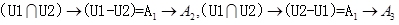
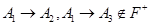
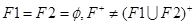

### 数据库系统

### 数据库模式★★

#### 三级模式-两层映射

- 外模式：用户模式（逻辑描述）——视图级别
- 内模式：物理存储——文化级别
- 概念模式：模式——表级别
- 两层映射：外模式-概念模式、内模式-概念模式

~~~~
采用三级结构/两级映像的数据库体系结构，如果对数据库的一张表创建聚簇索引，改变的是数据库的（  ）。
（51）A．用户模式
B.外模式
C.模式
D.内模式
试题分析
对表的操作是模式级进行的操作,创建索引是内模式。AB是同一个概念。
试题答案
（51）D

~~~~

~~~
(2016年上半年试题51)
数据的物理独立性和逻辑独立性分别是通过修改（  ）来完成的。
（51）A．外模式与内模式之间的映像、模式与内模式之间的映像 
B.外模式与内模式之间的映像、外模式与模式之间的映像 
C.外模式与模式之间的映像、模式与内模式之间的映像 
D.模式与内模式之间的映像、外模式与模式之间的映像
试题分析
物理独立性是指的内模式发生变化，只需要调整模式与内模式之间的映像，而不用修改应用程序。
逻辑独立性是指的模式发生变化，只需要调整外模式与模式之间的映像，而不用修改应用程序。
试题答案
（51）D

~~~

#### 数据库设计过程

1. 需求分析：**数据流图**、数据字典、需求说明书
2. 概念结构设计：ER模型
3. 逻辑结构设计：关系模式
4. 物理设计

### ER模型★★★★★

概念结构到逻辑结构之间的关系

- 属性
- 实体
- 联系
- 特殊化
- 弱实体

~~~
(2017年上半年试题15-16)
在采用结构化开发方法进行软件开发时，设计阶段接口设计主要依据需求分析阶段的（  ）。接口设计的任务主要是（  ）。

（15）A．数据流图
B.E-R图
C.状态-迁移图
D.加工规格说明

（16）A．定义软件的主要结构元素及其之间的关系
B.确定软件涉及的文件系统的结构及数据库的表结构
C.描述软件与外部环境之间的交互关系，软件内模块之间的调用关系
D.确定软件各个模块内部的算法和数据结构
试题分析
软件设计必须依据对软件的需求来进行，结构化分析的结果为结构化设计提供了最基本的输入信息。从分析到设计往往经历以下流程：
（1）研究、分析和审查数据流图。根据穿越系统边界的信息流初步确定系统与外部接口。
（2）根据数据流图决定问题的类型。数据处理问题通常有两种类型：变换型和事务型。针对两种不同的类型分别进行分析处理。
（3）由数据流图推导出系统的初始结构图。
（4）利用一些启发式原则来改进系统的初始结构图，直到得到符合要求的结构图为止。
（5）根据分析模型中的实体关系图和数据字典进行数据设计，包括数据库设计或数据文件的设计。
（6）在设计的基础上，依旧分析模型中的加工规格说明、状态转换图进行过程设计。
所以接口设计的主要依据是数据流图，接口设计的任务主要是描述软件与外部环境之间的交互关系，软件内模块之间的调用关系。
试题答案
（15）A（16）C

~~~

#### 一对一

#### 一对多

#### 多对多

1. 一个实体型转换为一个关系横式
2. 联系转关系模式：
   - 1：1联系：可将联系合并至任意一端的实体关系模式中。
   - 1：n联系：可将联系合并至n端实体关系模式中。
   - m:n联系：联系必须单独转成关系模式。

3. 三个以上实体间的一个多元联系

​		在数据库逻辑结构的设计中，将E-R模型转换为关系模型应遵循相关原则。对于三个不同实体集和它们之间的多对多联系m:n:p，最少可转换为4个关系模式。

~~~
(2017年上半年试题54-56)
在某企业的工程项目管理系统的数据库中供应商关系Supp、项目关系Proj和零件关系Part的E-R模型和关系模式如下:

 
Supp（供应商号,供应商名,地址,电话）
Proj（项目号,项目名,负责人,电话）
Part（零件号,零件名）
其中，每个供应商可以为多个项目供应多种零件，每个项目可由多个供应商供应多种零件。SP P需要生成一个独立的关系模式，其联系类型为（  ）
给定关系模式SP P（供应商号,项目号,零件号,数量）查询至少供应了3个项目（包含3项）的供应商，输出其供应商号和供应零件数量的总和，并按供应商号降序排列。
            SELECT   供应商号，SUM（数量） FROM（  ）
               GROUP BY 供应商号
                         （  ）
                ORDER BY 供应商号DESC;
（54）A．*:*:*
B.1:*:*
C.1:1:*
D.1:1:1

（55）A．Supp
B.Proj
C.Part
D.SP P

（56）A．HAVING COUNT(项目号)>2
B.WHERE COUNT(项目号)>2
C.HAVING COUNT(DISTINCT(项目号))>2
D.WHERE COUNT(DISTINCT(项目号))>3
试题分析
	由于1个供应商对应多个项目供应的多种零件，同时1个项目由多个供应商供应多种零件，所以三个实体都涉及到多。这个三元联系为：*:*:*。
       后面2个空考查的是SQL语言，目前需要查询的是零件数量总和，很明显在题目的多个关系中只有SP_P有这个属性。所以查询只能FROM SP_P。接下来分析如何能把至少供应了3个项目的供应商找出来，此时需要写查询条件。查询条件Where 与Having的区别要弄清楚，Where是针对单条记录的判断条件，而Having是针对分组之后的判断条件，此处应选Having，同时，由于考虑到项目号可能重复，所以需要加Distinct关键字以便去掉重复。
试题答案
（54）A（55）D（56）C

~~~

### 关系代数★★★

- 并
- 交
- 差
- 笛卡尔积
- 投影(列，π12，πname1name2)
- 选择(行)
- 联接（先笛卡尔积、再选择、最后投影）

~~~
试题10(2016年下半年试题54-55)
给定关系R（A ， B ， C ，D）和关系S（A ，C ，E ，F），对其进行自然连接运算R?S后的属性列为（  ）个；与σR.B>S.E(R?S)等价的关系代数表达式为（  ）。
（54）A．4
B.5
C.6
D.8 

（55）A．σ2>7（R x S）
B.π1,2,3,4,7,8（σ1=5^2>7^3=6（R×S））
C.σ2>'7'（R×S）
D.π1,2,3,4,7,8（σ1=5^2>’7’^3=6（R×S））

~~~

~~~
试题11(2016年下半年试题56)
下列查询B=“大数据”且F=“开发平台”，结果集属性列为A、B、C、F的关系代数表达式中，查询效率最高的是（  ）。
（56）A．π1,2,3,8 （σ2='大数据' ^ 1=5 ^ 3=6 ^ 8='开发平台'（R×S）） 
B.π1,2,3,8 （σ1=5 ^ 3=6 ^ 8='开发平台'（σ2='大数据'（R）×S））
C.π1,2,3,8（σ2='大数据' ^ 1=5 ^ 3=6（R×σ4='开发平台'（S））
D.π1,2,3,8（σ1=5 ^ 3=6（σ2='大数据'（R）×σ4='开发平台'（S）））
试题分析
优化SQL语句，减少比较次数是提高查询效率的有效方法。
在这个题目中，如果连接的两个表越小，那么连接的时候多余的数据就更少，D答案将可以对子表做的操作先做了，最后做连接，是效率最高的一种方法。
试题答案
（56）D

~~~

### 规范化理论★★★★★

- 数据冗余
- 修改异常
- 插入异常
- 删除异常

#### 依赖

设R（U）是属性U上的一个关系模式，X和Y是U的子集，r为R的任一关系，如果对于r中的任意两个元组u，V，只要有u[x]=V[X]，就有u[]=v[]，则称X函数决定Y，或称Y函数依赖于X，记为X→Y。

依赖集2：A->C

~~~~
试题9(2016年下半年试题52-53)典型例题
给定关系模式R（U,F），其中：U为关系模式R中的属性集，F是U上的一组函数依赖。假设U={A1，A2，A3，A4}，F={A1→A2，A1A2→A3，A1→A4，A2→A4}，那么关系R的主键应为（  ）。函数依赖集F中的（  ）是冗余的。
（52）A．A1
B.A1A2
C.A1A3
D.A1A2A3 

（53）A．A1→A2
B.A1A2→A3
C.A1→A4
D.A2→A4
试题分析
A1A2→A3，
A1→A4，A2→A4
这两者是有差别的！！！
本题中U1={A1、A2、A3、A4}，构造出依赖关系图之后，A1是入度为0的结点，且从A1出发能遍历全图，因此A1为主键。
A1->A2，A2->A4利用传递率：A1->A4，因此A1->A4是冗余。
有点明白了….
试题答案
（52）A（53）C

~~~~

~~~
(2015年下半年试题55-56)1nf 2NF 规范化程度 计算
设有关系模式R（A1,A2,A3,A4,A5,A6），其中：函数依赖集F={A1→A2,A1A3→A4,A5A6→A1,A2A5→A6,A3A5→A6},则（  ）是关系模式R的一个主键，R规范化程度最高达到（  ）。
（55）A．A1A4 
B.A2A4 
C.A3A5 
D.A4A5 

（56）A．1NF 
B.2NF 
C.3NF 
D.BCNF
试题分析
求候选码：关系模式码的确定，设关系模式R<U，F>：1、首先应该找出F中所有的决定因素，即找出出现在函数依赖规则中“→”左边的所有属性，组成集合U1；2、再从U1中找出一个属性或属性组K，运用Armstrong公理系统及推论，使得K→U，而K真子集K′→U不成立；这样就得到了关系模式R的一个候选码，找遍U1属性的所有组合，重复过程（2），最终得到关系模式R的所有候选码。
在本题中 U1={A1、A2、A3、A5、A6}
A3A5→A6，A5A6→A1 利用伪传递率：A3A5→A1，A1→A2利用传递率：A3A5→A2
A3A5→A1，A1A3→A4利用伪传递率：A3A5→A4
因此A3A5→{ A1，A2，A3，A4，A5，A6}
注：Armstrong公理系统及推论如下：
自反律：若Y⊆X⊆U，则X→Y为F所逻辑蕴含
增广律：若X→Y为F所逻辑蕴含，且Z⊆U，则XZ→YZ为F所逻辑蕴含
传递律：若X→Y和Y→Z为F所逻辑蕴含，则X→Z为F所逻辑蕴含
合并规则：若X→Y,X→Z,则X→YZ为F所蕴涵
伪传递率：若X→Y,WY→Z,则XW→Z为F所蕴涵
分解规则：若X→Y,Z⊆Y,则X→Z为F所蕴涵
由于函数依赖中存在传递依赖，所以不满足3NF的要求。
 
试题答案
（55）C（56）B

~~~

#### 键

~~~
(2015年上半年试题51)
若关系R (H，L，M，P)的主键为全码(All-key)，则关系R的主键应（  ）。
（51）A．为HLMP 
B.在集合{H，L，M，P）中任选一个 
C.在集合{ HL，HM，HP，LM，LP，MP）中任选一个 
D.在集合{H LM，HLP，HMP，LMP）中任选一个
试题分析
All-key关系模型的所有属性组成该关系模式的候选码，称为全码。
试题答案
（51）A

~~~

~~~
(2016年上半年试题54-56)典型例题 都讲到了 再研究
某公司数据库中的元件关系模式为P（元件号，元件名称，供应商，供应商所在地，库存量），函数依赖集F如下所示：
        F={元件号→元件名称，（元件号，供应商）→库存量，供应商→供应商所在地}
元件关系的主键为（  ），该关系存在冗余以及插入异常和删除异常等问题。为了解决这一问题需要将元件关系分解（  ），分解后的关系模式可以达到（  ）。
（54）A．元件号，元件名称 
B.元件号，供应商 
C.元件号，供应商所在地 
D.供应商，供应商所在地 

（55）A．元件1（元件号，元件名称，库存量）、元件2（供应商，供应商所在地） 
元件与供应商无联系
B.元件1（元件号，元件名称）、元件2（供应商，供应商所在地，库存量） 
元件与供应商无联系
C.元件1（元件号，元件名称）、元件2（元件号，供应商，库存量）、元件3（供应商，供应商所在地） 
D.元件1（元件号，元件名称）、元件2（元件号，库存量）、元件3（供应商，供应商所在地）、元件4（供应商所在地，库存量） 
元件与供应商无联系

（56）A．1NF 
B.2NF 
C.3NF 
D.4NF
试题分析
本题第1空的正确选项为B。根据题意，零件关系的主键为（零件号，供应商）。
 
本题第2空的正确选项为C。因为关系P存在冗余以及插入异常和删除异常等问题。
为了解决这一问题需要将零件关系分解。选项A，选项B和选项D是有损连接的，且不保持函数依赖性故分解是错误的，例如，分解为选项A、选项B和选项D后，用户无法查询某零件由哪些供应商供应，原因是分解有损连接的，且不保持函数依赖。
本题第3空的正确选项为C。因为，原零件关系存在非主属性对码的部分函数依赖：（零件号，供应商）供应商所在地，但是供应商→供应商所在地，故原关系模式零件非2NF的。分解后的关系模式零件1、零件2和零件3消除了非主属性对码的部分函数依赖，同时不存在传递依赖，故达到3NF。
试题答案
（54）B（55）C（56）C

~~~

#### 求候选键

图示法求候选键

1. 将关系的函数依赖关系，用“有向图”的方式表示。
2. 找出入度为0的属性，并以该属性集合为起点，尝试遍历有向图，若能正常遍历图中所有结点，则该属性集即为关系模式的**候选键**。
3. 若入度为0的属性集不能遍历图中所有结点，则需要尝试性的将一些中间结点（既有入度，也有出度的结点）并入入度为0的属性集中，直至该集合能遍历所有结点，集合为候选键。

例题1：A1

例题1：A\B\D\C

例题1：A和B

#### 主属性与非主属性

​		定义：组成候选码的属性就是主属性，其它的就是非主属性。

​		例：关系模式CSZ（CITY，ST，ZIP），其属性组上的函数依赖集为：F={（CITY，ST）→ZIP，ZIP→CITY}

​		其中CITY表示城市，ST表示街道，ZIP表示邮政编码。（没有非主属性、只有主属性：（ST，CITY）（ST，ZIP））

~~~
(2016年上半年试题53)有图哦
若给定的关系模式为R<u,f>，U={A,B,C}，F = {AB→C,C→B}，则关系R（  ）。
（53）A．有2个候选关键字AC和BC，并且有3个主属性 
B.有2个候选关键字AC和AB，并且有3个主属性 
C.只有一个候选关键字AC，并且有1个非主属性和2个主属性 
D.只有一个候选关键字AB，并且有1个非主属性和2个主属性
试题分析
将本题关系模式R的函数依赖关系表达为图示为：
 
从图中可以看出，A的入度为零，所以他必然为候选关键字的一部分。
通过A与B组合，或A与C组合，均能遍历全图，所以候选关系字有：AB和AC，因此A、B、C均是主属性。
试题答案
（53）B

~~~

#### 范式

- 第一范式（1NF）：在关系模式R中，当且仅当所有域只包含**原子值**，即每个**属性都是不可再分的数据项**，则称关系模式R是第一范式。
  		例如：关系模式R（系名称，高级职称人数）是否满足1NF，如果不满足，应该如何调整？

- 第二范式（2NF）：当且仅当关系模式R是第一范式（1NF），且每一个非主属性完全依赖候选键（没有不完全依赖）时，则称关系模式R是第二范式。

  ​		思考题：关系模式SC（学号，课程号，成绩，学分），其中：（学号，课程号）→
  成绩，课程号→学分，会存在哪些问题（从数据冗余、更新异常、插入异常、删除异常这几个方面来考虑），解决方案是什么？

- 第三范式（3NF）：当且仅当关系模式R是第二范式（2NF），且R中没有非主属性传递依赖于候选键时，则称关系模式R是第三范式。

  ​		思考题：学生关系（学号，姓名，系号，系名，系位置）各属性分别代表学号，姓名，所在系号，系名称，系地址。思考该关系模式会存在哪些问题（从数据冗余、更新异常、插入异常、删除异常这几个方面来考虑），解决方案是什么？

- BC范式（BCNF）：设R是一个关系模式，F是它的依赖集，R属于BCNF当且仅当其F中每个依赖的决定因素必定包含R的某个候选码。

  ​		例：关系模式STJ（S，T，J）中，S表示学生，T表示老师，表示课程。每一老师只教一门课程。每门课程有若干老师，某一学生选定某门课，就对应一个固定老师。

~~~
(2017年下半年试题52-53)
某企业的培训关系模式R（培训科目，培训师，学生，成绩，时间，教室）， R的函数依赖集 F={培训科目→→培训师，（学生，培训科目）→成绩，（时间，教室）→培训科目，（时间，培训师）→教室，（时间，学生）→教室}。关系模式R的主键为（  ），其规范化程度最高达到（  ）。
（52）A．（学生，培训科目）
B.（时间，教室）
C.（时间，培训师）
D.（时间，学生）

（53）A．1NF
B.2MF
C.3NF
D.BCNF
试题分析
1、时间和学生为主键。
2、存在传递函数依赖，时间和教室—>培训科目； 学生、培训科目-à成绩。
试题答案
（52）D（53）B

~~~

#### 模式分解

保持函数依赖分解

​		设数据库模式p={R1，R2，…，Rk）是关系模式R的一个分解，F是R上的函数依赖集，p中每个模式Ri上的FD集是Fi。如果{1，F2，…，Fk）与F是等价的（即相互逻辑蕴涵），那么称分解p保持FD。

​		例：设关系模式R（U，F），其中U=（A，B，C，D，E}，F={A→BC，C→D，BC→E，E→A}，则分解p={R1（ABCE），R2（CD）}保持函数依赖。分解p={R1（ABE），R2（CD）没有保持函数依赖

#### 无损分解

​		什么是有损，什么又是无损？

- 有损：不能还原。
- 无损：可以还原。
- 无损联接分解：指将一个关系模式分解成若干个关系模式后，通过自然联接和投影等运算仍能还原到原来的关系模式

推理法：

表格法：

公式法（两个）：

​		定理：如果R的分解为p={R1，R2}，F为R所满足的函数依赖集合，分解p具有无损联接性的充分必要条件是：

~~~
R1∩Rz→（R1-R2）
或
R1∩Rz→（R2-R1）
~~~

​		其中，

		-  R1∩R2表示模式的交，为R1与R2中公共属性组成，
		-  R1-R2或R2-R1表示模式的差集，R1-R2表示R1中去除R1和R2的公共属性所组成。

​		模式R分解成两个关系模式R，和R2时，如果R1与R2的公共属性能函数决定R1中或R2中的其它属性，这样的分解就具有无损联接性。
​		例：设R=ABC，F={A→B}，则分解P1={R1（AB），R2（AC）}与分解P2={R1（AB），R3（BC）}是有损分解

~~~
(2017年下半年试题54-55)
设关系模式R（U，F），其中：U= {A，B，C，D，E } ，F={A→B，DE→B，CB→E，E→A，B→D}。（  ）为关系模式R的候选关键字。分解（  ）是无损连接，并保持函数依赖的。
（54）A．AB
B.DE
C.DB
D.CE

（55）A．ρ={ R1(AC),R2(ED),R3(B) }
B.ρ={ R1(AC),R2(E),R3(DB) }
C.ρ={ R1(AC),R2(ED),R3(AB) }
D.ρ={ R1(ABC),R2(ED),R3(ACE) }
试题分析
1、肯定需要C，因为C是独立的，CE可以遍历全图。
2、使用表格法还原。
试题答案
（54）D（55）D

~~~

~~~
(2015年上半年试题52)这里有分解哦 典型例题
给定关系模式R(A1,A2,A3,A4)上的函数依赖集F={A1A3->A2,A2->A3}。若将R分解为p ={( A1,A2),( A1,A3)}，则该分解是（  ）的。
（52）A．无损联接且不保持函数依赖
B.无损联接且保持函数依赖
C.有损联接且保持函数依赖
D.有损联接且不保持函数依赖
试题分析
本题考查关系数据库规范化理论方面的基础知识。
试题（52）正确答案为D。设U1={A1，A2}，U2={A1，A3}，那么可得出：
 而 ，多以分解ρ是有损连接的。
又因为 ，所以分解不保持函数依赖。
 
试题答案
（52）D

~~~

### SQL语言★★★★

### 并发控制★★

验算不对-->不可重复读

### 数据库完整性约束★

- 实体完整性约束
  - 有主键
  - 有唯一性
- 参照完整性约束
  - 外键
- 用户自定义完整性约束
- 触发器

~~~
(2017年上半年试题51-52)
若事务T1对数据 D1 加了共享锁，事务 T2 、T3分别对数据D2 、D3 加了排它锁，则事务T1对数据（  ）;事务T2对数据（  ）。

（51）A． D2 、D3 加排它锁都成功
B. D2 、D3 加共享锁都成功
C. D2 加共享锁成功 ，D3 加排它锁失败
D. D2 、D3 加排它锁和共享锁都失败

（52）A． D1 、D3 加共享锁都失败
B. D1、D3 加共享锁都成功
C. D1 加共享锁成功 ，D3 如排它锁失败
D. D1 加排它锁成功 ，D3 加共享锁失败
试题分析
共享锁（S锁）：又称读锁，若事务T对数据对象A加上S锁，其他事务只能再对A加S锁，而不能加X锁，直到T释放A上的S锁。
排他锁（X锁）：又称写锁。若事务T对数据对象A加上X锁，其他事务不能再对A加任何锁，直到T释放A上的锁。
试题答案
（51）D（52）C

~~~

~~~
(2015年下半年试题53-54)
在分布式数据库中有分片透明、复制透明、位置透明和逻辑透明等基本概念，其中：（  ）是指局部数据模型透明，即用户或应用程序无需知道局部使用的是哪种数据模型；（  ）是指用户或应用程序不需要知道逻辑上访问的表具体是如何分块存储的。
（53）A．分片透明 
B.复制透明 
C.位置透明 
D.逻辑透明 

（54）A．分片透明 
B.复制透明 
C.位置透明 
D.逻辑透明
试题分析
分片透明性是指用户不必关系数据是如何分片的，它们对数据的操作在全局关系上进行，即关系如何分片对用户是透明的，因此，当分片改变时应用程序可以不变。分片透明性是最高层次的透明性，如果用户能在全局关系一级操作，则数据如何分布，如何存储等细节自不必关系，其应用程序的编写与集中式数据库相同。
复制透明：用户不用关心数据库在网络中各个节点的复制情况，被复制的数据的更新都由系统自动完成。在分布式数据库系统中，可以把一个场地的数据复制到其他场地存放，应用程序可以使用复制到本地的数据在本地完成分布式操作，避免通过网络传输数据，提高了系统的运行和查询效率。但是对于复制数据的更新操作，就要涉及到对所有复制数据的更新。
位置透明性：是指用户不必知道所操作的数据放在何处，即数据分配到哪个或哪些站点存储对用户是透明的。因此，数据分片模式的改变，如把数据从一个站点转移到另一个站点将不会影响应用程序，因而应用程序不必改写。
局部映像透明性（逻辑透明）是最低层次的透明性，该透明性提供数据到局部数据库的映像，即用户不必关系局部DBMS支持哪种数据模型、使用哪种数据操纵语言，数据模型和操纵语言的转换是由系统完成的。因此，局部映像透明性对异构型和同构异质的分布式数据库系统是非常重要的。
试题答案
（53）D（54）A

~~~

