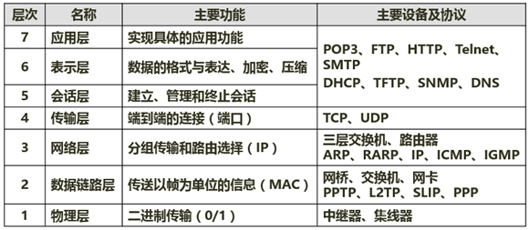
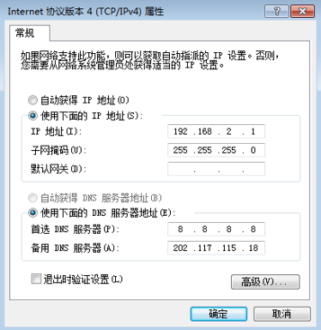
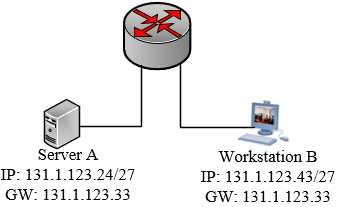

## 计算机网络与信息安全

### 1. 开放系统互连参考模型-★★

#### 1.1 OSI/RM七层模型

传输层：报文
网络层：包
数据链路层：帧
物理层：二进制

中继器：百米信号不失真

集线器：Hub，分流，不能解决分流冲突率

交换机：能够解决集线器的问题，会出现广播问题

路由器：解决交换机的广播问题

ARP：地址解析协议，ip地址改为mac地址

~~~
(2016年上半年试题66-67)
默认情况下，FTP服务器的控制端口为（  ），上传文件时的端口为（  ）。
（66）A．大于1024的端口 
B.20 
C.80 
D.21 

（67）A．大于1024的端口 
B.20 
C.80 
D.21
试题分析
FTP协议占用两个标准的端口号：20和21，其中20为数据口，21为控制口。
试题答案
（66）D（67）B

~~~

### 2. TCP/IP协议族-★★★★

#### 2.0 真题

1. （2018-上）网络管理员通过命令行方式对路由器进行管理，要确保 ID、口令和会话内容的保密性，应采取的访问方式是（   ） 。 
   A.控制台     B. AUX       C. TELNET       D. SSH 

   ~~~
   解析:
   SSH为SecureShell 的缩写，由IETF 的网络小组(Network Working Group)所制定; SSH为建立在应用层基础上的安全协议，专为远程登录会话和其他网络服务提供安全性的协议。利用SSH协议可以有效防止远程管理过程中的信息泄露问题。
   ~~~

   ~~~
   (2017年上半年试题69)
   在异步通信中，每个字符包含 1 位起始位、7位数据位和2位终止位，若每秒钟传送500个字符，则有效数据速率为（  ）。
   （69）A．500b/s
   B.700b/s
   C.3500b/s
   D.5000b/s
   试题分析
   每个字符的位数为1+7+2=10，每秒传输500个字符，故每秒传输的位数为10*500=5000，即码元速率为5000波特，每个字符中的有效数据占7位，因此每秒的有效数据为3500bit，则有效数据速率为3500b/s。
   试题答案
   （69）C
   
   ~~~
   
   ~~~
   (2015年下半年试题68)
   TCP使用的流量控制协议是（  ）。
   （68）A．固定大小的滑动窗口协议 
   B.后退N帧的ARQ协议 
   C.可变大小的滑动窗口协议 
   D.停等协议
   试题分析
   在TCP的实现机制中，为了保障传输的可靠性，所以发送方每发送一个报文，接收方接到之后会回发确认信息。如果发送端的数据过多或者数据发送速率过快，致使接收端来不及处理，则会造成数据在接收端的丢弃。为了避免这种现象的发生，通常的处理办法是采用流量控制，即控制发送端发送的数据量及数据发送速率。
   流量控制的目的是在接收端有限承受能力的情况下，通过流量约束，减少接收端处的数据丢失，提高数据发送效率，充分利用接收端资源。
   可变滑动窗口流量控制的基本过程如下：
   1、在建立TCP连接阶段，双方协商窗口尺寸，同时接收端预留数据缓冲区；
   2、发送端根据协商的结果，发送符合窗口尺寸的数据字节流，并等待对方的确认；
   3、发送端根据确认信息，改变窗口的尺寸。
   注：窗口也就是缓冲区，发送方窗口大小决定了一次可以连续发送多少个数据。
   试题答案
   （68）C
   
   ~~~
   
   ~~~
   (2014年上半年试题69)
   某用户在使用校园网中的一台计算机访问某网站时，发现使用域名不能访问该 网站，但是使用该网站的IP地址可以访问该网站，造成该故障产生的原因有很多，其中不包括（  ）。
   （69）A．该计算机设置的本地DNS服务器工作不正常 
   B.该计算机的DNS服务器设置错误 
   C.该计算机与DNS服务器不在同一子网 
   D.本地DNS服务器网络连接中断
   试题分析
   本题主要考查网络故障判断的相关知识。
   如果本地的DNS服务器工作不正常或者本地DNS服务器网络连接中断都有可能导致该计算机的DNS无法解析域名，而如果直接将该计算机的DNS服务器设置错误也会导致DNS无法解析域名，从而出现使用域名不能访问该网站，但是使用该网站的IP地址可以访问该网站。但是该计算机与DNS服务器不在同一子网不会导致DNS无法解析域名的现象发生，通常情况下大型网络里面的上网计算机与DNS服务器本身就不在一个子网，只要路由可达DNS都可以正常工作。
   试题答案
   （69）C
   
   ~~~
   
   

~~~
(2017年下半年试题68)
SNMP是一种异步请求/响应协议，采用（  ）协议进行封装。
（68）A．IP
B.ICMP
C.TCP
D.UDP
试题分析
SNMP：简单网络管理协议，使用UDP协议进行封装。
试题答案
（68）D

~~~

~~~
试题6(2017年上半年试题66)
在浏览器地址栏输入一个正确的网址后，本地主机将首先在（  ）查询该网址对应的IP地址。
（66）A．本地DNS缓存
B.本机hosts文件
C.本地DNS服务器
D.根域名服务器
试题分析
域名查询记录：先本地DNS缓存，再HOSTS表，然后再查找本地DNS服务器，再根域名服务器，顶级域名服务器、权限域名服务器。
试题答案
（66）A

~~~

~~~
(2016年下半年试题66-67)
以下协议中属于应用层协议的是（  ），该协议的报文封装在（  ）。
（66）A．SNMP
B.ARP
C.ICMP
D.X.25 

（67）A．TCP
B.IP
C.UDP
D.ICMP
试题分析
ARP和ICMP是网络层协议，X.25是标准的接口协议，只有SNMP是应用层协议。
SNMP协议的报文是封装在UDP协议中传送。
试题答案
（66）A（67）C

~~~

~~~
(2015年下半年试题67)
POP3协议采用（  ）模式，客户端代理与POP3服务器通过建立TCP连接来传送数据。 
（67）A．Browser/Server 
B.Client/Server 
C.Peer to Peer 
D.Peer to Server
试题分析
POP3，全名为“Post Office Protocol - Version 3”，即“邮局协议版本3”。是TCP/IP协议族中的一员，由RFC1939 定义。本协议主要用于支持使用客户端远程管理在服务器上的电子邮件。提供了SSL加密的POP3协议被称为POP3S。
POP3协议特性：
POP3协议默认端口：110；。
POP3协议默认传输协议：TCP；
POP3协议适用的构架结构：C/S；
POP3协议的访问模式：离线访问。
试题答案
（67）B

~~~

~~~
(2014年下半年试题67-68)
ICMP协议属于因特网中的（  ）协议，ICMP协议数据单元封装在（  ）中传送。
（67）A．数据链路层
B.网络层
C.传输层
D.会话层

（68）A．以太帧
B.TCP段
C.UDP数据报
D.IP数据报
试题分析
ICMP是网络层协议，在IP数据段传输ICMP数据单元。
试题答案
（67）B（68）D

~~~

CSMA/CD：载波监听多点接入访问

POP3：110，收邮件

FTP：20/21，传输

Telnet：23，远程访问

SMTP：25，简单邮件协议

NFS：文件服务

- POP3：110端口，邮件收取
- SMTP：25端口，邮件发送
- FTP：20数据端口/21控制端口，文件传输协议
- HTTP：80端口，超文本传输协议，网页传输
- DHCP：67端口，IP地址自动分配
- SNMP：161端口，简单网络管理协议
- DNS：53端口，域名解析协议，记录域名与1P的映射关系
- TCP：可靠的传输层协议
- UDP：不可靠的传输层协议
- ICMP：因特网控制协议，PING命令来自该协议
- IGMP：组播协议
- ARP：地址解析协议，IP地址转换为MAC地址
- RARP：反向地址解析协议，MAC地址转IP地址

~~~
(2017年下半年试题67)
若一台服务器只开放了25和110两个端口，那么这台服务器可以提供（  ）服务。
（67）A．E-Mail
B.WEB
C.DNS
D.FTP
试题分析
110是 PPO3
25端口为SMTP（Simple Mail Transfer Protocol，简单邮件传输协议）服务器所开放，主要用于发送邮件。

~~~

~~~
(2014年下半年试题69)
DHCP客户端可从DHCP服务器获得（  ）。
（69）A．DHCP服务器的地址和Web服务器的地址
B.DNS服务器的地址和DHCP服务器的地址
C.客户端地址和邮件服务器地址
D.默认网关的地址和邮件服务器地址
试题分析
本试题考查DHCP协议的工作原理。
DHCP客户端可从DHCP服务器获得本机IP地址、DNS服务器的地址、DHCP服务器的地址、默认网关的地址等，但没有Web服务器、邮件服务器地址。
试题答案
（69）B

~~~

### 3.IP地址与子网划分-★★★★★

- A：0~ 127 | 2^24-2
- B：128~ 191  | 2^16-2
- C：192~   |2^8-2

1. 子网掩码
2. 将一个网络划分成多个子网（取部分主机号当子网号）
3. 将多个网络合并成一个大的网络（取部分网络号当主机号）

例1，将B类IP地址168.195.0.0划分成27个子网，子网掩码为多少？

例2，将B类IP地址168.195.0.0划分成若干子网，每个子网内有主700台，则子网掩码为多少？

27<32，借出5位为子网

255.255.248.0

512<700<1024，需要借出10位为主机号

~~~
(2016年下半年试题70)
与地址220.112.179.92匹配的路由表的表项是（  ）。
（70）A． 220.112.145.32/22
B. 220.112.145.64/22
C. 220.112.147.64/22
D. 220.112.177.64/22
试题分析
地址220.112.179.92中179的二制码为1011 0011，假如网络号采用22位，即220.112.176.0/22~220.112.179.255/22范围内的，与该地址匹配的路由表项则为220.112.177.64/22。
试题答案
（70）D

~~~

~~~
(2016年上半年试题69)
某PC的Internet协议属性参数如下图所示，默认网关的IP地址是（  ）。 
 
（69）A．8.8.8.8 
B.202.117.115.3 
C.192.168.2.254 
D.202.117.115.18
试题分析
给出的备选答案中，仅有选项C与当前主机在同一个网段，所以仅有该地址能充当网关角色。
试题答案
（69）C

~~~

~~~
(2015年下半年试题69)
以下4种路由中，（  ）路由的子网掩码是255.255.255.255。
（69）A．远程网络 
B.静态 
C.默认 
D.主机
试题分析
主机路由和网络路由是由目的地址的完整度区分的，主机路由的目的地址是一个完整的主机地址（子网掩码固定为255.255.255.255）。网络路由目的地址是一个网络地址（主机号部分为0）。当为某个目的I P地址搜索路由表时，主机地址项必须与目的地址完全匹配，而网络地址项只需要匹配目的地址的网络号和子网号就可以了。
试题答案
（69）D

~~~

~~~
(2015年上半年试题66)
在下图所示的网络配置中，发现工作站B无法与服务器A通信。（  ）故障影响了两者互通。
 
（66）A．服务器A的IP地址是广播地址 
B.工作站B的IP地址是网络地址 
C.工作站B与网关不属于同一子网 
D.服务器A与网关不属于同一子网
试题分析
24: 0001 1000
43:0010 1011
33:0010 0001 掩码
做与运算 不相等 不能通信
试题答案
（66）D

~~~

~~~
(2014年下半年试题70)
分配给某公司网络的地址块是210.115.192.0/20，该网络可以被划分为（  ）个C类子网。
（70）A．4
B.8
C.16
D.32
试题分析
由于分配给公司网络的地址块是210.115.192.0/20，留给子网掩码的比特数只有（24-20）4位，所以只能划分为16个C类子网，这16个C类子网的子网号为11000000~11001111，即192~207，所以210.115.210.0不属于该公司的网络地址。
试题答案
（70）C

~~~

~~~
(2014年上半年试题66-67)
IP地址块155.32.80.192/26包含了（  ）个主机地址，以下IP地址中，不属于这个网络的地址是（  ）。
（66）A．15
B.32
C.62
D.64
（67）A．155.32.80.202
B.155.32.80.195
C.155.32.80.253
D.155.32.80.191
试题分析
变长子网的可用主机数计算公式为2n-2（n为表示主机的位数）/26即主机位为32-26=6，所以可用主机地址为64-2=62。
用IP地址155.32.80.192与子网掩码进行逻辑与运算得出该IP地址所在的网络号为：155.32.80.192；所在网段的广播地址为：155.32.80.255；所以与该IP地址不在同一网段的是选项D
试题答案
（66）C（67）D

~~~

### 4. 网络规划与设计-★

#### 4.1 规划设计

~~~
(2017年下半年试题69)
在一台安装好TCP/IP协议的计算机上，当网络连接不可用时，为了测试编写好的网络程序，通常使用的目的主机IP地址为（  ）。
（69）A．0.0.0.0
B.127.0.0.1
C.10.0.0.1
D.210.225.21.255/24
试题分析
127.0.0.1是回送地址，指本地机，一般用来测试使用。回送地址（127.x.x.x）是本机回送地址（Loopback Address），
即主机IP堆栈内部的IP地址，主要用于网络软件测试以及本地机进程间通信，无论什么程序，一旦使用回送地址发送数据，协议软件立即返回，不进行任何网络传输。
试题答案
（69）B

~~~

~~~
(2015年下半年试题70)
以下关于层次化局域网模型中核心层的叙述，正确的是（  ）。
（70）A．为了保障安全性，对分组要进行有效性检查 
B.将分组从一个区域高速地转发到另一个区域 
C.由多台二、三层交换机组成 
D.提供多条路径来缓解通信瓶颈
试题分析
层次化网络设计中各个层次的主要功能包括：
接入层：用户接入、计费管理、MAC地址认证、收集用户信息。
汇聚层：网络访问策略控制、数据包处理、过滤、寻址。
核心层：高速数据交换，常用冗余机制。
试题答案
（70）B

~~~

~~~
(2013年下半年试题67-68)
在IPv4向IPv6过渡期间，如果要使得两个IPv6结点可以通过现有的IPv4网络进行通信，则应该使用（  ）；如果要使得纯IPv6结点可以与纯IPv4结点进行通信，则需要使用（  ）。
（67）A．堆栈技术 
B.双协议栈技术 
C.隧道技术 
D.翻译技术 

（68）A．堆栈技术 
B.双协议栈技术 
C.隧道技术 
D.翻译技术
试题分析
IPv4和IPv6的过渡期间，主要采用三种基本技术。
（1）双协议栈：主机同时运行IPv4和IPv6两套协议栈，同时支持两套协议。
（2）隧道技术：这种机制用来在IPv4网络之上连接IPv6的站点，站点可以是一台主机，也可以是多个主机。隧道技术将IPv6的分组封装到IPv4的分组中，封装后的IPv4分组将通过IPv4的路由体系传输，分组报头的“协议”域设置为41，指示这个分组的负载是一个IPv6的分组，以便在适当的地方恢复出被封装的IPv6分组并传送给目的站点。
（3）NAT-PT ：利用转换网关来在IPv4和IPv6网络之间转换IP报头的地址，同时根据协议不同对分组做相应的语义翻译，从而使纯IPv4和纯IPv6站点之间能够透明通信。
试题答案
（67）C（68）D

~~~

~~~~
(2013年上半年试题66)
网络配置如下图所示，其中使用了一台路由器、一台交换机和一台集线器，对于这种配置，下面的论断中正确的是（  ）。

（66）A．2个广播域和2个冲突域 
B.1个广播域和2个冲突域 
C.2个广播域和5个冲突域 
D.1个广播域和8个冲突域
试题分析
路由器是用于连接多个逻辑上分开的网络，所谓逻辑网络是代表一个单独的网络或者一个子网。当数据从一个子网传输到另一个子网时，可通过路由器的路由功能来完成。因此，路由器具有判断网络地址和选择IP路径的功能。路由器的每个端口所连接的网络都独自构成一个广播域。
集线器内部，各接口都是通过背叛总线连接在一起的，在逻辑上构成一个共享的总线。所以，集线器和所有接口的主机共同构成了一个冲突域和一个广播域。
交换机上每个接口都是自己的一个冲突域。交换机和所有的接口所连接的主机共同构成了一个广播域。
试题答案
（66）C
~~~

#### 4.2 计算机网络分类

~~~
(2015年上半年试题67)
以下关于VLAN的叙述中，属于其优点的是（  ）。
（67）A．允许逻辑地划分网段 
B.减少了冲突域的数量 
C.增加了冲突域的大小 
D.减少了广播域的数量
试题分析
VLAN即虚拟局域网，其优点是：限制网络上的广播，将网络划分为多个VLAN可减少参与广播风暴的设备数量。LAN分段可以防止广播风暴波及整个网络。VLAN可以提供建立防火墙的机制，防止交换网络的过量广播。使用VLAN，可以将某个交换端口或用户赋于某一个特定的VLAN组，该VLAN组可以在一个交换网中或跨接多个交换机，在一个VLAN中的广播不会送到VLAN之外。同样，相邻的端口不会收到其他VLAN产生的广播。这样可以减少广播流量，释放带宽给用户应用，减少广播的产生。
试题答案
（67）A

~~~

### 5. 3G与4G标准-★★

#### 5.1 网络接入技术

~~~
(2015年上半年试题68)
以下关于URL的叙述中，不正确的是（  ）。
（68）A．使用www.abc.com和abc.com打开的是同一页面
B.在地址栏中输入www.abc.com默认使用http协议
C.www.abc.com中的“www”是主机名
D.www.abc.com中的“abc.com”是域名
试题分析
本题考查URL的使用和格式的基本知识。
URL由三部分组成：资源类型、存放资源的主机域名、资源文件名。
URL的一般语法格式为（带方括号[]的为可选项）：
Protocol :// hostname[:port] /path /filename
其中，protocol制定使用的传输协议，最常见的是HTTP或者HTTPS协议，也可以有其他协议，如file、ftp、gopher、mms、ed2k等；hostname是指主机名，即存放资源的服务域名或者IP地址；port是指各种传输协议所使用的默认端口号，该选项是可选选项，例如http的默认端口号为80，一般可以省略，如果为了安全考虑，可以更改默认的端口号，这时，该选项是必选的；path是指路径，有一个或者多个“/”分隔，一般用来表示主机上的一个目录或者文件地址；filename是指文件名，该选项用于指定需要打开的文件名称。
一般情况下，一个URL可以采用“主机名．域名”的形式打开指定页面，也可以单独使用“域名”来打开指定页面，但是这样实现的前提是需进行相应的设置和对应。
试题答案
（68）A

~~~

~~~
(2014年上半年试题70)
中国自主研发的3G通信标准是（  ）。
（70）A．CDMA2000
B.TD-SCDMA
C.WCDMA
D.WiMAX
试题分析
W-CDMA：英文名称是Wideband Code Division Multiple Access，中文译名为宽带码分多址，它可支持384kbps到2Mbps不等的数据传输速率，支持者主要以GSM系统为主的欧洲厂商。
CDMA2000：亦称CDMA Multi-Carrier，由美国高通北美公司为主导提出，摩托罗拉、Lucent和后来加入的韩国三星都有参与，韩国现在成为该标准的主导者。
TD-SCDMA：该标准是由中国独自制定的3G标准，由于中国的庞大的市场，该标准受到各大主要电信设备厂商的重视，全球一半以上的设备厂商都宣布可以支持TD-SCDMA标准。
试题答案
（70）B

~~~

### 6. HTML语言-★★

## 对称加密技术

### 1. 对称加密与非对称加密-★★★

#### 1.0 真题

1. （2018-上）在安全通信中，S 将所发送的信息使用（   ）进行数字签名，T 收到该消息后可利用（   ）验证该消息的真实性。  
   A.S 的公钥   B. S 的私钥   C. T 的公钥   D. T 的私钥  
   A.S 的公钥   B. S 的私钥   C. T 的公钥   D. T 的私钥 

~~~~
   BA
   数字加密和数字签名的区别？
   ●数字加密是用接收者的公钥加密，接收者用自己的私钥解密。
   ●数字签名是:将摘要信息用发送者的私钥加密，与原文-起传送给接收者。接收者只有用发送者的公钥才能解密被加密的摘要信息，然后用HASH函数对收到的原文产生-个新摘要信息，与解密的摘要信息对比。
~~~~

对称加密: K.=Kg;

- 加密强度不高,但效率高
- 密钥分发困难，

常见对称密钥加密算法: DES、3DES(三重DES)、 RC-5、IDEA算法

非对称加密:密钥必须成对使用(公钥加密。相应的私钥解密)

- 加密速度慢
- 强度高。

常见非对称密钥加密算法: RSA、 ECC

### 2.信息摘要与数字签名-★★

数字摘要:由单向散列函数加密成固定长度的散列值。

~~~
(2016年下半年试题7)
可用于数字签名的算法是（  ）。
（7）A．RSA
B.IDEA
C.RC4
D.MD5
试题分析
IDEA算法和RC4算法都对称加密算法，只能用来进行数据加密。MD5算法是消息摘要算法，只能用来生成消息摘要无法进行数字签名。
RSA算法是典型的非对称加密算法，主要具有数字签名和验签的功能。
试题答案
（7）A

~~~

### 3. 数字证书-★★

## 网络安全

### 1. 网络安全协议-★★★

#### 1.0 真题

1. （2018-上）在网络安全管理中，加强内防内控可采取的策略有（  ） 。 
   ①控制终端接入数量 
   ②终端访问授权，防止合法终端越权访问
   ③加强终端的安全检查与策略管理
   ④加强员工，上网行为管理与违规审计
   A.②③
   B.②④
   c.①②③④
   D.②③④

~~~
D
~~~

隔离：隔离网闸

屏蔽：堡垒

PGP：加密邮件

~~~~
(2015年下半年试题9)
根据下图所示的输出信息，可以确定的是（  ）。

（9）A．本地主机正在使用的端口号是公共端口号 
B.192.168.0.200正在与128.105.129. 30建立连接 
C.本地主机与202.100.112.12建立了安全连接 
D.本地主机正在与100.29.200.110建立连接
试题分析
Netstat命令的连接状态包括：
LISTEN：侦听来自远方的TCP端口的连接请求。
SYN-SENT：在发送连接请求后等待匹配的连接请求。
SYN-RECEIVED：在收到和发送一个连接请求后等待对方对连接请求的确认。
ESTABLISHED：代表一个打开的连接。
FIN-WAIT-1：等待远程TCP连接中断请求，或先前的连接中断请求的确认。
FIN-WAIT-2：从远程TCP等待连接中断请求。
CLOSE-WAIT：等待从本地用户发来的连接中断请求。
CLOSING：等待远程TCP对连接中断的确认。
LAST-ACK：等待原来的发向远程TCP的连接中断请求的确认。
TIME-WAIT：等待足够的时间以确保远程TCP接收到连接中断请求的确认。
CLOSED：没有任何连接状态。
试题答案
（9）C

~~~~

### 2. 防火墙技术与网络攻击-★★★

#### 2.0 真题

1. （2018-上）攻击者通过发送- -个目的主机已经接收过的报文来达到攻击目的，这种攻击方式属于()攻击。
   A.重放
   B.拒绝服务
   C.数据截获
   D.数据流分析

~~~
A
~~~

#### 2.1 主动攻击与被动攻击

~~~
(2017年下半年试题9)
下列攻击行为中，属于典型被动攻击的是（  ）。
（9）A．拒绝服务攻击
B.会话拦截
C.系统干涉
D.修改数据命令
试题分析
ABD为主动攻击。
试题答案
（9）C

~~~

~~~
(2017年下半年试题10)
（  ）不属于入侵检测技术。
（10）A．专家系统
B.模型检测
C.简单匹配
D.漏洞扫描
试题分析
漏洞扫描为另一种安全防护策略。
试题答案
（10）D

~~~

~~~
(2015年下半年试题7)
（  ）不属于主动攻击。
（7）A．流量分析
B.重放
C.IP地址欺骗
D.拒绝服务
试题分析
主动攻击包括拒绝服务攻击、分布式拒绝服务（DDos）、信息篡改、资源使用、欺骗、伪装、重放等攻击方法。
试题答案
（7）A

~~~

#### 2.2 Dos与DDos拒绝服务攻击

#### 2.3  防火墙

~~~
(2014年下半年试题7)
网络系统中，通常把（  ）置于DMZ区。
（7）A．网络管理服务器 
B.Web服务器 
C.入侵检测服务器 
D.财务管理服务器
试题分析
DMZ是英文“demilitarized zone”的缩写，中文名称为“隔离区”，也称“非军事化区”。它是为了解决安装防火墙后外部网络不能访问内部网络服务器的问题，而设立的一个非安全系统与安全系统之间的缓冲区，这个缓冲区位于企业内部网络和外部网络之间的小网络区域内，在这个小网络区域内可以放置一些必须公开的服务器设施，如企业Web服务器、FTP服务器和论坛等。另一方面，通过这样一个DMZ区域，更加有效地保护了内部网络，因为这种网络部署，比起一般的防火墙方案，对攻击者来说又多了一道关卡。
试题答案
（7）B

~~~

~~~
(2013年下半年试题7)
下列网络攻击行为中，属于DoS攻击的是（  ）。
（7）A．特洛伊木马攻击 
B.SYN Flooding攻击 
C.端口欺骗攻击 
D.IP欺骗攻击
试题分析
DoS是Denial of Service的简称，即拒绝服务，造成DoS的攻击行为被称为DoS攻击，其目的是使计算机或网络无法提供正常的服务。最常见的DoS攻击有计算机网络带宽攻击和连通性攻击。
作个形象的比喻来理解DoS。街头的餐馆是为大众提供餐饮服务，如果一群地痞流氓要DoS餐馆的话，手段会很多，比如霸占着餐桌不结账，堵住餐馆的大门不让路，骚扰餐馆的服务员或厨子不能干活，甚至更恶劣……
SYN Flooding攻击便是Dos攻击的典型代表，该攻击以多个随机的源主机地址向目的路由器发送SYN包，而在收到目的路由器的SYN ACK后并不回应，这样，目的路由器就为这些源主机建立了大量的连接队列，而且由于没有收到ACK一直维护着这些队列，造成了资源的大量消耗而不能向正常请求提供服务，甚至导致路由器崩溃。服务器要等待超时（Time Out）才能断开已分配的资源。
试题答案
（7）B

~~~

#### 2.4 安全防护体系

1. 物理环境安全性

   ​		包括通信线路、物理设备和机房的安全等。物理层的安全主要体现在通信线路的可靠性（线路备份、网管软件和传输介质）、软硬件设备的安全性（错换设备、拆卸设备、增加设备）、设备的备份、防灾富能力、防干扰能力、设备的运行环境（温度、温度、烟尘）和不间断电源保障等。

2. 操作系统安全性

   ​		主要表现在三个方面，一是操作系统本身的缺陷带来的不安全因素，主要包括身份认证、访问控制和系统漏洞等；二是对操作系统的安全配置问题；三是病毒对操作系统的威胁。

3. 网络安全性

   ​		网络层的安全问题主要体现在计算机网络方面的安全性，包括网络层身份认证、网络资源的访问控制、数据传输的保密与完整性、远程接入的安全、域名系统的安全、路由系统的安全、入侵检测的手段和网络设施防病毒等。

4. 应用安全性

   ​		由提供服务所采用的应用软件和数据的安全性产生，包括Web服务、电子邮件系统和DNS等。此外，还包括病毒对系统的威胁。

5. 管理安全性

   ​		包括安全技术和设备的管理、安全管理制度、部门与人员的组织规则等。管理的制度化极大程度地影响着整个计算机网络的安全，严格的安全管理制度、明确的部门安全职责划分与合理的人员角色配置，都可以在很大程度上降低其他展次的安全漏洞。

~~~
(2014年下半年试题66)
PPP中的安全认证协议是（  ），它使用三次握手的会话过程传送密文。
（66）A．MD5
B.PAP
C.CHAP
D.HASH
试题分析
一、安全认证介绍  
1、PPP的NCP可以承载多种协议的三层数据包。  
2、PPP使用LCP控制多种链路的参数（建立、认证、压缩、回拨） 
二、PPP的认证类型  
1、PPP的pap认证是通过二次握手建立认证（明文不加密）  
2、PPP的chap挑战握手认证协议，通过三次握手建立认证（密文采用MD5加密） 
3、PPP的双向验证，采用的是chap的主验证风格  
4、PPP的加固验证，采用的是两种（pap,chap）验证同时使用
试题答案
（66）C

~~~

~~~
(2015年上半年试题8-9)
安全需求可划分为物理线路安全、网络安全、系统安全和应用安全。下面的安全需求中属于系统安全的是（  ），属于应用安全的是（  ）。
（8）A．机房安全
B.入侵检测
C.漏洞补丁管理
D.数据库安全
（9）A．机房安全
B.入侵检测
C.漏洞补丁管理
D.数据库安全
试题分析
机房安全属于物理安全，入侵检测属于网络安全，漏洞补丁管理属于系统安全，而数据库安全则是应用安全。
试题答案
（8）C（9）D
~~~

#### 计算机病毒与木马-★★★

​		病毒：破坏为主，编制或者在计算机程序中插入的破坏计算机功能或者破坏数据，影响计算机使用并且能够自我复制的一组计算机指令或者程序代码。
​		木马：窃取为主，计算机木马是一种后门程序，常被黑客用作控制远程计算机的工界

- 系统病毒（前缀：Win32、PE、W32，如：KCOM-Win32.KCOM）
- 螺虫病毒（如：恶鹰—Worm.BBeagle）
- 木马病毒、黑客病毒（如：QQ消息尾巴木马—Trojan.QQ3344）
- 脚本病毒（如：红色代码—Script.Redlof）
- 宏病毒（如：美丽莎—Macro.Melissa）
- 后门病毒（如：灰鸽子—Backdoor.Win32.Huigezi）·病毒种植程序病毒（冰河播种者—Dropper.BingHe2.2C）
- 破坏性程序病毒（杀手命令—Harm.Command.Killer）
- 玩笑病毒（如：女鬼—Jioke.Grl ghost）
- 捆绑机病毒（如：捆绑QQ-BinderQQPass.QQBin）

~~~~
(2014年下半年试题9)
（  ）不是蠕虫病毒。
（9）A．熊猫烧香 
B.红色代码 
C.冰河 
D.爱虫病毒
试题分析
熊猫烧香是一种经过多次变种的“蠕虫病毒”变种，2006年10月16日由25岁的中国湖北武汉新洲区人李俊编写，这是名副其实的病毒，拥有感染传播功能，2007年1月初肆虐网络，它主要通过下载的档案传染，受到感染的机器文件因为被误携带间接对其它计算机程序、系统破坏严重。2013年6月病毒制造者张顺和李俊伙同他人开设网络赌场案，再次获刑。
“红色代码”病毒是2001年一种新型网络病毒，其传播所使用的技术可以充分体现网络时代网络安全与病毒的巧妙结合，将网络蠕虫、计算机病毒、木马程序合为一体，开创了网络病毒传播的新路，可称之为划时代的病毒。
冰河是一种木马软件。
2000年5月4日，一种名为“我爱你”的电脑病毒开始在全球各地迅速传播。这个病毒是通过Microsoft Outlook电子邮件系统传播的，邮件的主题为“I LOVE YOU”，并包含一个附件。一旦在Microsoft Outlook里打开这个邮件，系统就会自动复制并向地址簿中的所有邮件电址发送这个病毒。 “我爱你”病毒，又称“爱虫”病毒，是一种蠕虫病毒，它与1999年的梅丽莎病毒非常相似。据称，这个病毒可以改写本地及网络硬盘上面的某些文件。用户机器染毒以后，邮件系统将会变慢，并可能导致整个网络系统崩溃。
试题答案
（9）C

~~~~

~~~
(2014年上半年试题7)
以下关于木马程序的叙述中，正确的是（  ）。
（7）A．木马程序主要通过移动磁盘传播
B. 木马程序的客户端运行在攻击者的机器上
C. 木马程序的目的是使计算机或网络无法提供正常的服务
D. Sniffer是典型的木马程序
试题分析
传播方式：
1、通过邮件附件、程序下载等形式传播
2、通过伪装网页登录过程，骗取用户信息进而传播
3、通过攻击系统安全漏洞传播木马，大量黑客使用专门的黑客工具来传播木马。木马程序危害在于多数有恶意企图，例如占用系统资源，降低电脑效能，危害本机信息安全（盗取QQ帐号、游戏帐号甚至银行帐号），将本机作为工具来攻击其他设备等。Sniffer 是用于拦截通过网络传输的TCP/IP/UDP/ICMP等数据包的一款工具，可用于分析网络应用协议，用于网络编程的调试、监控通过网络传输的数据、检测木马程序等。
试题答案
（7）B

~~~

~~~

~~~