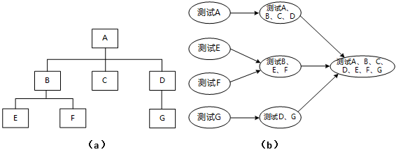
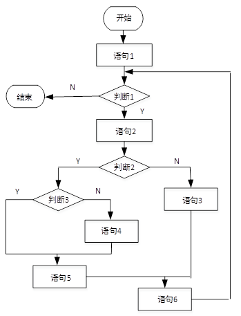

##  系统开发基础

### 1. 开发模型-★★★★★

#### 瀑布模型

（需求明确-不能满足现在的开发要求）

- 软件计划
- 需求分析（70%的失误）
- 软件设计（概要设计、详细设计）
- 程序编码
- 软件测试
- 运行维护

~~~
(2014年上半年试题30)
某公司要开发一个软件产品，产品的某些需求是明确的，而某些需求则需要进一步细化。由于市场竞争的压力，产品需要尽快上市，则开发该软件产品最不适合采用（  ）模型。
（30）A．瀑布 
B.原型 
C.增量 
D.螺旋
试题分析
瀑布模型（Waterfall Model） 是一个项目开发架构，开发过程是通过设计一系列阶段顺序展开的，从系统需求分析开始直到产品发布和维护，每个阶段都会产生循环反馈，因此，如果有信息未被覆盖或者发现了问题，那么最好 “返回”上一个阶段并进行适当的修改，项目开发进程从一个阶段“流动”到下一个阶段，这也是瀑布模型名称的由来。包括软件工程开发、企业项目开发、产品生产以及市场销售等构造瀑布模型。
试题答案
（30）A

~~~

#### V模型

（侧重测试）

- 需求分析
- 概要设计
- 详细设计
- 编码
- 单元测试
- 集成测试
- 系统测试
- 验收测试

#### 喷泉模型

（迭代，需要更多管理，面向对象）

- 分析
- 设计
- 实现
- 测试
- 维护
- 演化

~~~
(2016年下半年试题29-30)
某开发小组欲为一公司开发一个产品控制软件，监控产品的生产和销售过程，从购买各种材料开始，到产品的加工和销售进行全程跟踪。购买材料的流程、产品的加工过程以及销售过程可能会发生变化。该软件的开发最不适宜采用（  ）模型，主要是因为这种模型（  ）。
（29）A．瀑布
B.原型
C.增量
D.喷泉 

（30）A．不能解决风险
B.不能快速提交软件
C.难以适应变化的需求
D.不能理解用户的需求
试题分析
对于较大型软件系统的需求往往难以在前期确定，所以瀑布模型最不适合。
试题答案
（29）A（30）C

~~~

~~~
(2015年下半年试题30)
（  ）开发过程模型以用户需求为动力，以对象为驱动，适合于面向对象的开发方法。
（30）A．瀑布 
B.原型 
C.螺旋 
D.喷泉
试题分析
备选答案中的几种开发模型中，只有喷泉模型属于面向对象开发模型。
试题答案
（30）D

~~~

#### 螺旋模型

（探索性原型、实验性原型）

- 演化模型
- 螺旋模型（成本很高）

~~~
(2017年上半年试题29)
以下关于螺旋模型的叙述中，不正确的是（  ）。
（29）A．它是风险驱动的，要求开发人员必须具有丰富的风险评估知识和经验
B.它可以降低过多测试或测试不足带来的风险
C.它包含维护周期，因此维护和开发之间没有本质区别
D.它不适用于大型软件开发
试题分析
螺旋模型是一种演化软件开发过程模型，它兼顾了快速原型的迭代的特征以及瀑布模型的系统化与严格监控。螺旋模型最大的特点在于引入了其他模型不具备的风险分析，使软件在无法排除重大风险时有机会停止，以减小损失。同时，在每个迭代阶段构建原型是螺旋模型用以减小风险的途径。螺旋模型更适合大型的昂贵的系统级的软件应用。
试题答案
（29）D

~~~

~~~
(2015年上半年试题29)
某公司计划开发一种产品，技术含量很高，与客户相关的风险也很多，则最适于采用（  ）开发过程模型。
（29）A．瀑布 
B.原型 
C.增量 
D.螺旋
试题分析
这些模型中仅有螺旋模型考虑风险因素。
试题答案
（29）D

~~~

#### 统一、增量模型

~~~
(2016年上半年试题30)
以下关于增量开发模型的叙述中，不正确的是（  ）。
（30）A．不必等到整个系统开发完成就可以使用 
B.可以使用较早的增量构件作为原型，从而获得稍后的增量构件需求 
C.优先级最高的服务先交付，这样最重要的服务接受最多的测试 
D.有利于进行好的模块划分
试题分析
在利用增量模型进行开发时，如何进行模块的划分往往是难点所在，而不是这种模型的优点。
试题答案
（30）D
~~~

~~~
(2014年下半年试题29)
以下关于增量模型的叙述中，正确的是（  ）。
（29）A．需求被清晰定义
B.可以快速构造核心产品
C.每个增量必须要进行风险评估
D.不适宜商业产品的开发
试题分析
增量模型融合了瀑布模型的基本成分（重复应用）和原型实现的迭代特征，该模型采用随着日程时间的进展而交错的线性序列，每一个线性序列产生软件的一个可发布的“增量”。当使用增量模型时，第1个增量往往是核心的产品，即第1个增量实现了基本的需求，但很多补充的特征还没有发布。客户对每一个增量的使用和评估都作为下一个增量发布的新特征和功能，这个过程在每一个增量发布后不断重复，直到产生了最终的完善产品。由于能够在较短的时间内向用户提交一些有用的工作产品，因此能够解决用户的一些急用功能。由于每次只提交用户部分功能，用户有较充分的时间学习和适应新的产品。
对系统的可维护性是一个极大的提高，因为整个系统是由一个个构件集成在一起的，当需求变更时只变更部分部件，而不必影响整个系统。
增量模型存在以下缺陷：
1） 由于各个构件是逐渐并入已有的软件体系结构中的，所以加入构件必须不破坏已构造好的系统部分，这需要软件具备开放式的体系结构。
2） 在开发过程中，需求的变化是不可避免的。增量模型的灵活性可以使其适应这种变化的能力大大优于瀑布模型和快速原型模型，但也很容易退化为边做边改模型，从而使软件过程的控制失去整体性。
3）如果增量包之间存在相交的情况且未很好处理，则必须做全盘系统分析，这种模型将功能细化后分别开发的方法较适应于需求经常改变的软件开发过程。
试题答案
（29）B

~~~

~~~
(2014年上半年试题29)
以下关于统一过程UP的叙述中，不正确的是（  ）。
（29）A．UP是以用例和风险为驱动，以架构为中心，迭代并且增量的开发过程 
B.UP定义了四个阶段，即起始、精化、构建和确认阶段 
C.每次迭代都包含计划、分析、设计、构造、集成、测试以及内部和外部发布 
D.每个迭代有五个核心工作流
试题分析
什么是 Rational 统一过程（ Rational Unified Process）?
Rational Unified Process 是软件工程的过程。它提供了在开发组织中分派任务和责任的纪律化方法。它的目标是在可预见的日程和预算前提下，确保满足最终用户需求的高质量产品。
统一过程模型是一种“用例驱动，以体系结构为核心，迭代及增量”的软件过程框架，由UML方法和工具支持。
RUP把一个项目分为四个不同的阶段：
构思阶段 ：包括用户沟通和计划活动两个方面，强调定义和细化用例，并将其作为主要模型。
细化阶段 ：包括用户沟通和建模活动，重点是创建分析和设计模型，强调类的定义和体系结构的表示。
构建阶段 ：将设计转化为实现，并进行集成和测试。
移交阶段 ：将产品发布给用户进行测试评价，并收集用户的意见，之后再次进行迭代修改产品使之完善。
试题答案
（29）B
~~~

#### 敏捷方法

- XP（Extreme Programming，极限编程）在所有的敏捷型方法中，XP是最引人瞩目的。它源于Smaltalk圈子，特别是Kent Beck和Ward Cunningham在20世纪80年代末的密切合作。XP在一些对**费用控制严格**的公司中的使用，已经被证明是非常有效的。

  ~~~
  (2017年下半年试题32)
  极限编程（XP）的十二个最佳实践不包括（  ）。
  （32）A．小的发布
  B.结对编程
  C.持续集成
  D.精心设计
  试题分析
  D应为简单设计。
  试题答案
  （32）D
  
  ~~~

  ~~~
  (2017年上半年试题30)
  以下关于极限编程(XP) 中结对编程的叙述中，不正确的是（  ）。
  （30）A． 支持共同代码拥有和共同对系统负责
  B. 承担了非正式的代码审查过程
  C. 代码质量更高
  D. 编码速度更快
  试题分析
  极限编程是一个轻量级的、灵巧的软件开发方法；同时它也是一个非常严谨和周密的方法。它的基础和价值观是交流、朴素、反馈和勇气；即，任何一个软件项目都可以从四个方面入手进行改善：加强交流；从简单做起；寻求反馈；勇于实事求是。XP是一种近螺旋式的开发方法，它将复杂的开发过程分解为一个个相对比较简单的小周期；通过积极的交流、反馈以及其它一系列的方法，开发人员和客户可以非常清楚开发进度、变化、待解决的问题和潜在的困难等，并根据实际情况及时地调整开发过程。XP就提倡结对编程（PairProgramming），而且代码所有权是归于整个开发队伍。其中的结对编程就是一种对代码的审查过程，XP主要解决代码质量低的问题，编码速度不能改变。
  试题答案
  （30）D
  
  ~~~

  

- Cockburn的水晶系列方法，水晶系列方法是由Alistair Cockburn提出的。它与XP方法一样，都有以人为中心的理念，但在实践上有所不同。Alistair考虑到人们一般很难严格遵循一个纪律约束很强的过程，因此，与XP的高度纪律性不同，Alistair探索了用**最少纪律约束**而仍能成功的方法，从而在产出效率与易于运作上达到一种平衡。也就是说，虽然水晶系列不如XP那样的产出效率，但会有更多的人能够接受并遵循它。

  ~~~
  (2015年上半年试题30)
  在敏捷过程的方法中（  ）认为每一个不同的项目都需要一套不同的策略、约定和方法论。
  （30）A．极限编程（XP） 
  B.水晶法(Crystal) 
  C.并列争球法(Scrum) 
  D.自适应软件开发(ASD)
  试题分析
  水晶方法，Crystal ，是由 Alistair Cockburn 和 Jim Highsmith 建立的敏捷方法系列，其目的是发展一种提倡“机动性的”[1] 方法，包含具有共性的核心元素，每个都含有独特的角色、过程模式、工作产品和实践。Crystal 家族实际上是一组经过证明、对不同类型项目非常有效的敏捷过程，它的发明使得敏捷团队可以根据其项目和环境选择最合适的 Crystal 家族成员。
  极限编程（Extreme Programming，XP）是一门针对业务和软件开发的规则，它的作用在于将两者的力量集中在共同的、可以达到的目标上。它是以符合客户需要的软件为目标而产生的一种方法论，XP使开发者能够更有效的响应客户的需求变化，哪怕是在软件生命周期的后期。它强调，软件开发是人与人合作进行的过程，因此成功的软件开发过程应该充分利用人的优势，而弱化人的缺点，突出了人在软件开发过程中的作用。极端编程属于轻量级的方法，认为文档、架构不如直接编程来的直接。
  试题答案
  （30）B
  
  ~~~

  

- 开放式源码，这里提到的开放式源码指的是开放源码界所用的一种运作方式。开放式源码项目有一个特别之处，就是程序开发人员在**地域上分布很广**，这使得它和其他敏捷方法不同因为一般的敏捷方法都强调项目组成员在同一地点工作。开放源码的一个突出特点就是查错排障（debug）的高度并行性，任何人发现了错误都可将改正源码的“补丁”文件发给维护者。然由维护者将这些“补丁”或是新增的代码并入源码库。

- SCRUM（并行）. SCRUM已经出现很久了，像前面所论及的方法一样，该方法强调这样一个事实，即明确定义了的**可重复的方法过程**只限于在明确定义了的可重复的环境中，为明确定义了可重复的人员所用，去解决明确定义了的可重的问题。

  ~~~
  (2016年下半年试题16)
  在敏捷过程的开发方法中，（  ）使用了迭代的方法，其中，把每段时间（30天）一次的迭代称为一个“冲刺”，并按需求的优先级别来实现产品，多个自组织和自治的小组并行地递增实现产品。
  
  （16）A．极限编程XP
  B.水晶法
  C.并列争球法
  D.自适应软件开发
  试题分析
  并列争球法使用了迭代的方法，其中，把每段时间（30天）一次的迭代称为一个“冲刺”，并按需求的优先级别来实现产品，多个自组织和自治的小组并行地递增实现产品。
  试题答案
  （16）C
  
  ~~~

  

- Coad的功用驱动开发方法(FDD-Feature Driven Development)，FDD是由Jeff De Luca和大师Peter Coad提出来的。像其他方法样， 它致力于短时的迭代阶段和可见可用的功能。在FDD中,一个迭代周期一般是两周。 
  在FDD中,编程开发人员分成两类;首席程序员和"类"程序员(class owner）。首席程序员是最富有经验的开发人员，他们是项目的协调者、设计者和指导者，而"类" 程序员则主要做源码编写.
  
- ASD方法，ASD (Adaptive Software Development)方法由Jim High   核心是三个非线性的、重叠的开发阶段:猜测、合作与学习。

### 2. 软件开发方法-★

#### 2.1 结构化

- 结构化方法（**面向数据流**的方法——数据流、图，不适合用于复杂的大型项目）
  - 用户至上
  - 严格区分工作 阶段,每阶段有任务和结果
  - 强调系统开发过程的整体性和全局性
  - 系统开发过程工程化,文档资料标准化
  - 自顶向下，逐步分解(求精)

~~~
(2015年下半年试题15-16)
若用户需求不清晰且经常发生变化，但系统规模不太大且不太复杂，则最适宜采用（  ）开发方法，对于数据处理领域的问题，若系统规模不太大且不本复杂，需求变化也不大，则最适宜采用（  ）开发方法。
（15）A．结构化 
B.Jackson 
C.原型化 
D.面向对象 

（16）A．结构化 
B.Jackson 
C.原型化 
D.面向对象
试题分析
在本题的两个空中，第1个空比较容易，由于题目明确说明“用户需求不清晰且经常发生变化”所以只有原型化方法适用。而第2空需求变化不大的情况下，其实多种模型都可用，所以另一条线索成为解题关键，即“数据处理领域问题”。结构化方法的基本特征是：自顶向下，逐层分解，也适合于不太大的数据处理系统，所以用他最合适。
试题答案
（15）C（16）A
~~~

~~~
(2014年下半年试题15)
以下关于结构化开发方法的叙述中，不正确的是（  ）。
（15）A．总的指导思想是自顶向下，逐层分解
B.基本原则是功能的分解与抽象
C.与面向对象开发方法相比，更适合于大规模、特别复杂的项目
D.特别适合于数据处理领域的项目
试题分析
结构化开发方法是一种面向数据流的开发方法，其基本思想是软件功能的分解和抽象。结构化开发方法又称生命周期法，是迄今为止最传统、应用最广泛的一种信息系统开发方法。结构化开发方法采用系统工程的思想和工程化的方法，按用户至上的原则，结构化、模块化、自顶向下地对信息系统进行分析与设计。该方法严格按照信息系统开发的阶段性开展设计工作，每个阶段都产生一定的设计成果，通过评估后再进入下一阶段开发工作。因此，结构化开发方法具有以下优点：
• 开发工作的顺序性、阶段性适合初学者参与软件的开发
• 开发工作的阶段性评估可以减少开发工作重复性和提高开发的成功率
• 该方法有利于提高系统开发的正确性、可靠性和可维护性
• 具有完整的开发质量保证措施
结构化开发方法存在的不足主要是开发周期太长，个性化开发阶段的文档编写工作量过大或过于烦琐,无法发挥开发人员的个性化开发 能力。一般来说，结构化开发方法主要适用于组织规模较大、组织结构相对稳定的企业，这些大型企业往往业务处理过程规范、信息系统数据需求非常明确，在一定时期内需求变化不大。
试题答案
（15）C

~~~

~~~
(2014年上半年试题15)
以下关于结构化开发方法的叙述中，不正确的是（  ）。
（15）A．将数据流映射为软件系统的模块结构
B.一般情况下，数据流类型包括变换流型和事务流型
C.不同类型的数据流有不同的映射方法
D.一个软件系统只有一种数据流类型
试题分析
面向数据流的设计是以需求分析阶段产生的数据流图为基础，按一定的步骤映射成软件结构，因此又称结构化设计。该方法由美国IBM公司L.Constantine和E.Yourdon等人于1974年提出，与结构化分析(SA)衔接，构成了完整的结构化分析与设计技术，是目前使用最广泛的软件设计方法之一。
各种软件系统，不论DFD如何庞大和复杂，一般可分为变换型和事务型，一个软件系统既可以只有一种数据流类型，也可以是两种数据流烈性。在结构化设计中，可以将数据流映射为软件系统的模块结构，不同类型的数据流有不同的映射方法。
试题答案
（15）D

~~~

#### 2.2 原型

- 原型法

#### 2.3 面向对象

- 面向对象方法
  - 更好的复用性
  - 关键在于建立一个全面、合理、统的模型
  - 分析、设计、实现三个阶段,界限不明确

#### 2.4 面向服务

- 面向服务的方法（SOA）

#### 2.5 面熟数据结构

- 面熟数据结构的方法（Sam）

~~~
试题27(2016年上半年试题32-33)
软件体系结构的各种风格中，仓库风格包含一个数据仓库和若干个其他构件。数据仓库位于该体系结构的中心，其他构件访问该数据仓库并对其中的数据进行增、删、改等操作。以下关于该风格的叙述中，不正确的是（  ）。（  ）不属于仓库风格。
（32）A．支持可更改性和可维护性 
B.具有可复用的知识源 
C.支持容错性和健壮性 
D.测试简单 
（33）A．数据库系统 
B.超文本系统 
C.黑板系统 
D.编译器
试题分析
仓库风格优点包括：
1、解决问题的多方法性
2、具胡可更改性和可维护性
3、有可重用的知识源
4、支持容错性和健壮性
缺点：
1、测试困难：由于黑板模式的系统有中央数据构件来描述系统的体现系统的状态，所以系统的执行没有确定的顺序，其结果的可再现性比较差，难于测试，
2、不能保证有好的求解方案
3、效率低
4、开发成本高
5、缺少对并行机的支持
 
仓库风格包括：数据库系统、黑板系统、超文本系统。
编译器可用多种架构风格实现。
试题答案
（32）D（33）D

~~~

~~~
(2015年上半年试题34)
自底向上的集成测试策略的优点包括（  ）。
（34）A．主要的设计问题可以在测试早期处理 
B.不需要写驱动程序 
C.不需要写桩程序 
D.不需要进行回归测试
试题分析
1、自顶向下集成
优点：较早地验证了主要控制和判断点；按深度优先可以首先实现和验证一个完整的软件功能；功能较早证实，带来信心；只需一个驱动，减少驱动器开发的费用；支持故障隔离。
缺点：柱的开发量大；底层验证被推迟；底层组件测试不充分。
适应于产品控制结构比较清晰和稳定；高层接口变化较小；底层接口未定义或经常可能被修改；产口控制组件具有较大的技术风险，需要尽早被验证；希望尽早能看到产品的系统功能行为。
2、自底向上集成
优点：对底层组件行为较早验证；工作最初可以并行集成，比自顶向下效率高；减少了桩的工作量；支持故障隔离。
缺点：驱动的开发工作量大；对高层的验证被推迟，设计上的错误不能被及时发现。
适应于底层接口比较稳定；高层接口变化比较频繁；底层组件较早被完成。
试题答案
（34）C

~~~

### 3. 需求分析-★

#### 3.1 需求的任务

#### 3.2 需求的过程

- 问题识别
- 分析与综合
- 编制需求分析文档
- 需求分析与评审

#### 3.3 需求的分类

- 功能需求
- 非功能需求
- 设计约束

#### 3.4 应用的工具

- 数据流图( DFD )
- 数据字典( DD )
- 判定表（基本条件项、条件项、基本工作项、工作项）-加工描述
- 判定树-加工描述

~~~
(2016年上半年试题17-18)
在结构化分析中，用数据流图描述（  ）。当采用数据流图对一个图书馆管理系统进行分析时，（  ）是一个外部实体。
（17）A．数据对象之间的关系，用于对数据建模 
B.数据在系统中如何被传送或变换，以及如何对数据流进行变换的功能或子功能，用于对功能建模
C.系统对外部事件如何响应，如何动作，用于对行为建模 
D.数据流图中的各个组成部分 

（18）A．读者 
B.图书 
C.借书证 
D.借阅
试题分析
数据流图用来记录系统中的数据和数据在特定的过程中的流动，即数据如何被采集、处理、保存和使用的（围绕信息系统的功能）。外部实体指系统之外又与系统有联系的人或事物。它表达了该系统数据的外部来源和去处。
试题答案
（17）B（18）A

~~~

~~~
(2013年下半年试题15)
以下关于数据流图中基本加工的叙述，不正确的是（  ）。
（15）A．对每一个基本加工，必须有一个加工规格说明 
B.加工规格说明必须描述把输入数据流变换为输出数据流的加工规则 
C.加工规格说明必须描述实现加工的具体流程 
D.决策表可以用来表示加工规格说明
试题分析
对基本加工的说明有三种描述方式：结构化语言、判断表（决策表）、判断树（决策树）。基本加工逻辑描述的基本原则为：
1、对数据流图的每一个基本加工，必须有一个基本加工逻辑说明。
2、基本加工逻辑说明必须描述基本加工如何把输入数据流变换为输出数据流的加工规则。
3、加工逻辑说明必须描述实现加工的策略而不是实现加工的细节。
4、加工逻辑说明中包含的信息应是充足的，完备的，有用的，无冗余的。
试题答案
（15）C

~~~

### 4. 软件设计-★★

#### 4.1 软件设计原则与应用工具

#### 4.2 内聚与耦合

- **功能内聚**（单一功能）>**顺序内聚**（顺序执行）>**通信内聚**（数据结构区域）>**过程内聚**（特定的次序）>**瞬时内聚**(时间间隔)>**逻辑内聚**（逻辑相关）>**偶然内聚**(巧合，没有关系、松散关系)
- **非直接耦合**（模块间没有关系，由主模块控制）>**数据耦合**（借助参数传递简单数据）>**标记耦合**（借助参数传递记录数据、数据结构）>**控制耦合**（控制模块内逻辑）>**外部耦合**（同意全局简单变量）>**公共耦合**（公共数据环境）>**内容耦合**（直接访问）
- 好>坏

~~~
(2017年上半年试题32)
在设计软件的模块结构时，（  ）不能改进设计质量。
（32）A．尽量减少高扇出结构
B.模块的大小适中
C.将具有相似功能的模块合并
D.完善模块的功能
试题分析
在结构化设计中，系统由多个逻辑上相对独立的模块组成，在模块划分时需要遵循如下原则：
（1）模块的大小要适中。系统分解时需要考虑模块的规模，过大的模块可能导致系统分解不充分，其内部可能包括不同类型的功能，需要进一步划分，尽量使得各个模块的功能单一；过小的模块将导致系统的复杂度增加，模块之间的调用过于频繁，反而降低了模块的独立性。一般来说，一个模块的大小使其实现代码在1～2页纸之内，或者其实现代码行数在50～200行之间，这种规模的模块易于实现和维护。
（2）模块的扇入和扇出要合理。一个模块的扇出是指该模块直接调用的下级模块的个数；扇出大表示模块的复杂度高，需要控制和协调过多的下级模块。扇出过大一般是因为缺乏中间层次，应该适当增加中间层次的控制模块；扇出太小时可以把下级模块进一步分解成若干个子功能模块，或者合并到它的上级模块中去。一个模块的扇入是指直接调用该模块的上级模块的个数；扇入大表示模块的复用程度高。设计良好的软件结构通常顶层扇出比较大，中间扇出较少，底层模块则有大扇入。一般来说，系统的平均扇入和扇出系数为3或4，不应该超过7，否则会增大出错的概率。
（3）深度和宽度适当。深度表示软件结构中模块的层数，如果层数过多，则应考虑是否有些模块设计过于简单，看能否适当合并。宽度是软件结构中同一个层次上的模块总数的最大值，一般说来，宽度越大系统越复杂，对宽度影响最大的因素是模块的扇出。在系统设计时，需要权衡系统的深度和宽度，尽量降低系统的复杂性，减少实施过程的难度，提高开发和维护的效率。
试题答案
（32）D

~~~

~~~
试题13(2017年上半年试题33-34)
模块A、B和 C有相同的程序块，块内的语句之间没有任何联系，现把该程序块取出来，形成新的模块D，则模块D的内聚类型为（  ）内聚。以下关于该内聚类型的叙述中，不正确的是（  ）。
（33）A．巧合
B.逻辑
C.时间
D.过程

（34）A．具有最低的内聚性
B.不易修改和维护
C.不易理解
D.不影响模块间的耦合关系
试题分析
功能内聚：完成一个单一功能，各个部分协同工作，缺一不可。
顺序内聚：处理元素相关，而且必须顺序执行。
通信内聚：所有处理元素集中在一个数据结构的区域上。
过程内聚：处理元素相关，而且必须按特定的次序执行。
瞬时内聚：所包含的任务必须在同一时间间隔内执行（如初始化模块）。
逻辑内聚：完成逻辑上相关的一组任务。
偶然内聚：完成一组没有关系或松散关系的任务。
巧合内聚就是偶然内聚。偶然内聚由于内容都是不相关的，所以必然导致它与外界多个模块有关联，这也使得模块间的耦合度增加。
试题答案
（33）A（34）D

~~~

~~~
(2016年上半年试题29)
如下图所示，模块A和模块B都访问相同的全局变量和数据结构，则这两个模块之间的耦合类型为（  ）耦合。
 
（29）A．公共 
B.控制 
C.标记 
D.数据
试题分析
公共耦合指通过一个公共数据环境相互作用的那些模块间的耦合。
试题答案
（29）A

~~~

~~~
(2016年上半年试题31)
在设计软件的模块结构时，（  ）不能改进设计质量。
（31）A．模块的作用范围应在其控制范围之内 
B.模块的大小适中 
C.避免或减少使用病态连接（从中部进入或访问一个模块） 
D.模块的功能越单纯越好
试题分析
高内聚是使模块的功能要相对独立和单一，这个功能单纯意思有出入
试题答案
（31）D

~~~

~~~
(2015年下半年试题32)
在进行子系统结构设计时，需要确定划分后的子系统模块结构，并画出模块结构图。该过程不需要考虑（  ）。
（32）A．每个子系统如何划分成多个模块 
B.每个子系统采用何种数据结构和核心算法 

C.如何确定子系统之间、模块之间传送的数据及其调用关系 
D.如何评价并改进模块结构的质量
试题分析
系统模块结构设计的任务是确定划分后的子系统的模块结构，并画出模块结构图，这个过程中必须考虑这样几个问题：每个子系统如何划分成若干个模块；如何确定子系统之间、模块之间传送的数据及其调用关系；如何评价并改进模块结构的质量；如何从数据流图导出模块结构图。
试题答案
（32）B

~~~

~~~
(2015年下半年试题33)
数据流图中某个加工的一组动作依赖于多个逻辑条件的取值，则用（  ）能够清楚地表示复杂的条件组合与应做的动作之间的对应关系。
（33）A．流程图 
B.NS盒图 
C.形式语言 
D.决策树
试题分析
NS盒图是用于取代传统流程图的一种描述方式。NS盒图形象直观，具有良好的可见度。例如循环的范围、条件语句的范围都是一目了然的，所以容易理解设计意图，为编程、复查、选择测试用例、维护都带来了方便。它能清楚的表达复杂条件组合与应做的动作之间的对应关系。
试题答案
（33）B

~~~

~~~
(2013年下半年试题16)
在划分模块时，一个模块的作用范围应该在其控制范围之内。若发现其作用范围不在其控制范围内，则（  ）不是适当的处理方法。
（16）A．将判定所在模块合并到父模块中，使判定处于较高层次 
B.将受判定影响的模块下移到控制范围内 
C.将判定上移到层次较高的位置 
D.将父模块下移，使判定处于较高层次
试题分析
一个模块的作用范围（或称影响范围）指受该模块内一个判定影响的所有模块的集合。
一个模块的控制范围指模块本身以及其所有下属模块（直接或间接从属于它的模块）的集合。
一个模块的作用范围应在其控制范围之内，且判定所在的模块应在其影响的模块在层次上尽量靠近。如果再设计过程中，发现模块作用范围不在其控制范围之内，可以用“上移判点”或“下移受判断影响的模块，将它下移到判断所在模块的控制范围内”的方法加以改进。
试题答案
（16）D

~~~

### 5. 软件测试与维护

~~~
(2016年上半年试题34-35)
下图（a）所示为一个模块层次结构的例子，图（b）所示为对其进行集成测试的顺序，则此测试采用了（  ）测试策略。该测试策略的优点不包括（  ）。

 
（34）A．自底向上 
B.自顶向下 
C.三明治 
D.一次性 

（35）A．较早地验证了主要的控制和判断点 
B.较早地验证了底层模块 
C.测试的并行程度较高 
D.较少的驱动模块和桩模块的编写工作量
试题分析
从先测试A，再测试A、B、C、D可以看出集成测试时用到了自顶向下的方式。
而从先测试E、F，再测试B、E、F可以看出集成测试时用到了自底向上的方式，两者结合即为三明治方式。
这种策略的优点是自顶向下与自底向上两种方式优点的综合。所以可以较早地验证了主要的控制和判断点且较早地验证了底层模块。同时由于可以两端向中间发展，所以效率也是比较高的，且运用一定的技巧，能够减少了桩模块和驱动模块的开发。所以本题的问题本身存在不严谨的现象。在选择答案时，由于”较少的驱动模块和桩模块的编写工作量“条款需要运用一定技巧，并非一定会减少，所以选其相对更合适。
试题答案
（34）C（35）D

~~~

​		例:小张帮朋友开发一个成绩分级程序,功能是这样的: 90-100分:优;80-89分:良; 70-79分;中; 60-69分;及格; 0-59分:不及格。对此,我们若采用等价类划分以及边界值分析,应该如何设计测试用例。

使用数轴进行等价类划分，对78 79 80进行边界值测试

~~~
(2015年下半年试题34)
根据软件过程活动对软件工具进行分类，则逆向工程工具属于（  ）工具。
（34）A．软件开发 
B.软件维护 
C.软件管理 
D.软件支持
试题分析
逆向工程是在软件维护时，由于缺少文档资料，而对软件的一种分析。
试题答案
（34）B

~~~

#### 5.1 白盒测试用例-★★★★

#### 5.2 McCabe复杂度计算-★★★

计算有向图G的环路复杂度公式为; V(G)=m-n+ 2.（15-12+2=5）=4个洞+外洞

说明:其中V(G)是有向图G中的环路个数, m是G中的有向弧数, n是G中的节点数

关键在于：通过函数来推导出图

4	4

~~~
(2017年上半年试题35-36)
对下图所示的程序流程图进行语句覆盖测试和路径覆盖测试，至少需要(  )个测试用例。采用McCabe 度量法计算其环路复杂度为（  ）。
 

（35）A．2和3
B.2和4
C.2和5
D.2和6

（36）A．1
B.2
C.3
D.4
试题分析
要满足语句覆盖的要求，只需要覆盖两条路径就能达到，所以语句覆盖2个用例即可。路径覆盖需要把程序中的4条路径均覆盖一遍，需要4个用例。
整个程序流程图转化为结点图之后，一共11个结点，13条边，根据环路复杂度公式有：13－11+2＝4。
试题答案
（35）B（36）D

~~~

~~~
(2014年上半年试题35-36)
采用白盒测试方法对下图进行测试，设计了4个测试用例：①（x=0,y=3）， ②(x=1,y=2)， ③(x=-1,y=2)，④(x=3,y=1)。至少需要测试用例①②才能完成（  ）覆盖，至少需要测试用例①②③或①②④才能完成（  ）覆盖。
 
（35）A．语句 
B.条件 
C.判定\条件 
D.路径 

（36）A．语句 
B.条件 
C.判定\条件 
D.路径
试题分析
语句覆盖（StatementCoverage） 又称行覆盖（LineCoverage），段覆盖（SegmentCoverage），基本块覆盖（BasicBlockCoverage），这是最常用也是最常见的一种覆盖方式，就是度量被测代码中每个可执行语句是否被执行到了，只管覆盖代码中的执行语句，却不考虑各种分支的组合等等。
路径覆盖的含义是，选取足够多的测试数据，使程序的每条可能路径都至少执行一次（如果程序图中有环，则要求每个环至少经过一次）。
试题答案
（35）A（36）D

~~~

#### 5.3 软件维护类型-★★★★

- 适应性维护。指使应用软件适应信息技术变化和管理需求变化而进行的修改， 企业的**外部市场环境**和管理需求的不断变化也使得各级理人员不断提出新的信息需求。
- 完善性维护。**扩充功能和改善性能**而进行的修改。对已有的软件系统增加一些在系统分析和设计阶段中没有规定的功能与性能特征。

~~~
(2014年下半年试题36)
以下关于软件维护和可维护性的叙述中，不正确的是（  ）。
（36）A．软件维护要解决软件产品交付用户之后运行中发生的各种问题
B.软件的维护期通常比开发期长得多，其投入也大得多
C.进行质量保证审查可以提高软件产品的可维护性
D.提高可维护性是在软件维护阶段考虑的问题
试题分析
在软件开发的各个阶段都需考虑软件的可维护性。
试题答案
（36）D

~~~

~~~
(2014年上半年试题34)
某搜索引擎在使用过程中，若要增加接受语音输入的功能，使得用户可以通过 语音输入来进行搜索，此时应对系统进行（  ）维护。
（34）A．正确性 
B.适应性 
C.完善性 
D.预防性
试题分析
在系统运行过程中，软件需要维护的原因是多样的，根据维护的原因不同，可以将软件维护分为以下四种：
（1）改正性维护。为了识别和纠正软件错误、改正软件性能上的缺陷、排除实施中的误使用，应当进行的诊断和改正错误的过程就称为改正性维护。
（2）适应性维护。在使用过程中，外部环境（新的硬、软件配置）、数据环境（数据库、数据格式、数据输入/输出方式、数据存储介质）可能发生变化。为使软件适应这种变化，而去修改软件的过程就称为适应性维护。
（3）完善性维护。在软件的使用过程中，用户往往会对软件提出新的功能与性能要求。为了满足这些要求，需要修改或再开发软件，以扩充软件功能、增强软件性能、改进加工效率、提高软件的可维护性。这种情况下进行的维护活动称为完善性维护。
（4）预防性维护。这是指预先提高软件的可维护性、可靠性等，为以后进一步改进软件打下良好基础。通常，预防性维护可定义为“把今天的方法学用于昨天的系统以满足明天的需要”。也就是说，采用先进的软件工程方法对需要维护的软件或软件中的某一部分（重新）进行设计、编码和测试。
试题答案
（34）C

~~~

### 6. 软件质量保证-★

#### 6.1 软件文档管理指南-按阅读对象分类

##### 6.1.1 开发文档

- 可行性研究和项目任务书
- 需求规格说明
- 功能规格说明
- 设计规格说明(包括程序和数据规格说明)
- 开发计划
- 软件集成和测试计划
- 质保证计划、标准、进度
- 安全和测试信息

~~~
(2015年上半年试题16)
在（  ）设计阶段选择适当的解决方案，将系统分解为若干个子系统，建立整个系统的体系结构。
（16）A．概要
B.详细
C.结构化
D.面向对象
试题分析
本题考查软件工程的基本概念。
软件设计的任务是基于需求分析的结果建立各种设计模型，给出问题的解决方案。从工程管理的角度，可以将软件设计分为两个阶段：概要设计阶段和详细设计阶段。结构化设计方法中，概要设计阶段进行软件体系结构的设计、数据设计和接口设计；详细设计阶段进行数据结构和算法的设计。面对对象设计方法中，概要设计阶段进行体系结构设计、初步的类设计/数据设计、结构设计；详细设计阶段进行构件设计。
结构化设计和面向对象设计是两种不通过的设计方法，结构化设计根据系统的数据流图进行设计，模块体现为函数、过程及子程序；面向对象设计基于面向对象的基本概念进行，模块体现为类、对象和构件等。
试题答案
（16）A

~~~

##### 6.1.2 产品文档

- 培训手册
- 参考手册和用户指南
- 软件支持手册
- 产品手册和信息广告

##### 6.1.3 管理文档

- 开发过程的每个阶段的进度和
- 软件变更情况的记录
- 相对于开发的判定记录
- 职责定义

~~~
(2015年下半年试题31)
在ISO/IEC软件质量模型中，易使用性的子特性不包括（  ）。
（31）A．易理解性 
B.易学性 
C.易操作性 
D.易分析性
试题分析
 
试题答案
（31）D

~~~

~~~
(2015年上半年试题36)
以下关于软件可维护性的叙述中，不正确的是“可维护性（  ）”。
（36）A．是衡量软件质量的一个重要特性
B.不受软件开发文档的影响
C.是软件开发阶段各个时期的关键目标
D.可以从可理解性、可靠性、可测试性、可行性、可移植性等方面进行度量
试题分析
本题考查维护方面的基础知识。
软件交付给用户使用后到软件报废之前都属于软件维护阶段。软件系统的可维护性可以定义为：维护人员理解、改正、改动和改进该软件的难易程度。提供软件可维护性是开发软件系统所有步骤的关键目的，是衡量软件质量的一种重要特性，可以从可理解性、可靠性、可测试性、可行性、可移植性等方面进行度量。良好的软件开发文档可以有效地提高软件的可维护性。
试题答案
（36）B

~~~

### 7. 软件过程改进-★★

~~~
(2015年上半年试题15)
软件工程的基本要素包括方法、工具和（  ）。
（15）A．软件系统 
B.硬件系统 
C.过程 
D.人员
试题分析
本题考查软件工程的基本概念。
软件工程是一种层次化的技术，从底向上分别为质量、过程、方法和工具。任何工程方法必须以有组织的质量承诺为基础。软件工程的基础是过程，过程是将技术结合在一起的凝聚力，使得计算机软件能够被合理地和及时地开发，过程定义了一组关键过程区域，构成了软件项目管理控制的基础；方法提供了建造软件在技术上需要“如何做”， 它覆盖了一系列的任务。方法也依赖于一些基本原则，这些原则控制了每一个技术区域 而且包含建模活动和其他描述技术；工具对过程和方法提供了自动或半自动的支持，如：计算机辅助软件工程（CASE）。软件工程的基本要素包括方法、工具和过程。
试题答案
（15）C

~~~

### 8. 项目管理基础

#### 8.0 真题

~~~
AC
~~~

1. 范围管理
2. 时间管理
3. 成本管理
4. 质量管理
5. 人力资源管理
6. 沟通管理
7. 风险管理
8. 采购管理
9. 整体管理
10. 项目干系人管理

#### 8.1 Gant圈与Pert图-★★★★

​		关键路径法是在制订进度计划时使用的一种进度网络分析技术。关键路线法沿着项目进度网络路线进行正向与反向分析,从而计算出所有计划活动理论上的最早开始与完成日期、最迟开始与完成日期,不考虑任何资源限制。

​		总时差(**松弛时间**) ：在不延误总工期的前提下,该活动的机动时间。活动的总时差等于该活动最迟完成时间与最早完成时间之差,或该活动最迟开始时间与最早开始时间之差。

​		选择一条长的路径，接着在往前减。

#### 8.2 风险管理-★★★

 

​		风险曝光度( Risk Exposure) :计算方法是风险出现的概率乘以风险可能造成的损失。	

​		假设正在开发的软件项目可能存在一个未被发现的错误,而这个错误的概率是0.5% ,给公司造成的损失将是1000000元,那么这个错误的风险曝光就应为1000000x0.5%= 5000元

开发模型(★***★)

~~~
(2017年下半年试题34)
模块A将学生信息，即学生姓名、学号、手机号等放到一个结构体中，传递给模块B。模块A和B之间的耦合类型为（  ）耦合。
（34）A．数据
B.标记
C.控制
D.内容
试题分析
题干说明数据是参数传递的，所以是数据耦合。
试题答案
（34）A

~~~

~~~
(2016年下半年试题36)
某模块中有两个处理A和B，分别对数据结构X写数据和读数据，则该模块的内聚类型为（  ）内聚。
（36）A．逻辑
B.过程
C.通信
D.内容
试题分析
如果一个模块的所有成分都操作同一数据集或生成同一数据集，则称为通信内聚。
试题答案
（36）C

~~~

~~~
(2014年下半年试题30)
以下关于CMM的叙述中，不正确的是（  ）。
（30）A．CMM是指软件过程能力成熟度模型
B.CMM棍据软件过程的不同成熟度划分了5个等级，其中，1级被认为成熟度最高，5级被认为成熟度最低
C.CMMI的任务是将已有的几个CMM模型结合在一起，使之构造成为“集成模型”
D.采用更成熟的CMM模型，一般来说可以提高最终产品的质量
试题分析
CMM（Capability Maturity Model）是能力成熟度模型的缩写，CMM是国际公认的对软件公司进行成熟度等级认证的重要标准。CMM共分五级。在每一级中，定义了达到该级过程管理水平所应解决的关键问题和关键过程。每一较低级别是达到较高级别的基础。其中五级是最高级，即优化级，达到该级的软件公司过程可自发地不断改进，防止同类问题二次出现；四级称为已管理级，达到该级的软件公司已实现过程的定量化；三级为已定义级，即过程实现标准化；二级为可重复级，达到该级的软件公司过程已制度化，有纪律，可重复；一级为初始级，过程无序，进度、预算、功能和质量等方面不可预测。
试题答案
（30）B

~~~

