## 面向对象

### 1. 面向对象的基本概念-★★★★★

#### 1.1 概述

- 对象:属性(数据) +方法(操作) +对象ID
- 类(实体类/控制类/边界类)
- 继承与泛化:复用机制
- 封装:隐藏对象的属性和实现细节,仅对外公开接口
- 多态:（继承产生多态）不同对象收到同样的消息产生不同的结果
- 接口:一种特殊的类,他只有方法定义没有实现
- 重载:一个类可以有多个同名而参数类型不同的方法
- 重写：对定义接口、继承方法的实现
- 模板类
- 消息和消息通信:消息是异步通信的

##### 1.1.1 对象

~~~
(2017年下半年试题40)
面向对象分析过程中，从给定需求描述中选择（）来识别对象。
（40）A．动词短语
B.名词短语
C.形容词
D.副词
试题分析
名词短语暗示类及其属性动词和动词短语暗示对职责或操作。
试题答案
（40）B

~~~

~~~
(2015年下半年试题37-38)
在面向对象的系统中，对象是运行时实体，其组成部分不包括（）；一个类定义了一组大体相似的对象，这些对象共享（）。
（37）A．消息
B.行为（操作）
C.对象名
D.状态

（38）A．属性和状态
B.对象名和状态
C.行为和多重度
D.属性和行为
试题分析
对象的组成部分包括：对象名，状态（属性），行为（操作）。一个类产生的对象共享属性和行为。
试题答案
（37）A（38）D

~~~

~~~
(2015年上半年试题37)
对象、类、继承和消息传递是面向对象的4个核心概念。其中对象是封装（）的整体。
（37）A．命名空间
B.要完成任务
C.一组数据
D.数据和行为
试题分析
本题考查面向对象的基本知识。
面向对象的4个核心概念是对象、类、继承和消息传递。其中，对象是基本的运行时的实体，它既包括数据（属性），也包括作用于数据的操作（行为）。所以，一个对象把属性和行为封装为一个整体。类定义了一组大体上相似的对象。一个类所包含的方法和数据描述一组对象的共同行为和属性。在进行类设计时，有些类之间存在一般和特殊关系，即一些类是某个类的特殊情况，某个类是一些类的一般情况，这就是继承关系。消息是对象之间进行通信的一种构造，包含要求接收对象去执行某些活动的信息。
试题答案
（37）D

~~~

##### 1.1.2 多态

多态:（继承产生多态）不同对象收到同样的消息产生不同的结果

~~~
(2017年上半年试题37-38)
在面向对象方法中，两个及以上的类作为一个类的超类时，称为（），使用它可能造成子类中存在（）的成员。

（37）A．多重继承
B.多态
C.封装
D.层次继承

（38）A．动态
B.私有
C.公共
D.二义性
试题分析
多重继承是指一个类有多个父类，正是题目所述的情况。多重继承可能造成混淆的情况，出现二义性的成员。
试题答案
（37）A（38）D

~~~

~~~
(2016年下半年试题38)
在面向对象方法中，支持多态的是（）。
（38）A．静态分配
B.动态分配
C.静态类型
D.动态绑定
试题分析
动态绑定是实现多态的基础
试题答案
（38）D

~~~

~~~
(2014年下半年试题38)
多态分为参数多态、包含多态、过载多态和强制多态四种不同形式，其中（）多态在许多语言中都存在，最常见的例子就是子类型化。
（38）A．参数
B.包含
C.过载
D.强制
试题分析
多态分为两种：通用的多态和特定的多态。两者的区别是前者对工作的类型不加限制，允许对不同类型的值执行相同的代码；后者只对有限数量的类型有效，而且对不同类型的值可能要执行不同的代码。
通用的多态又分为参数多态（parametric）和包含多态（inclusion）；特定的多态分为过载多态（overloading）和强制多态（coercion）。
强制多态：编译程序通过语义操作，把操作对象的类型强行加以变换，以符合函数或操作符的要求。程序设计语言中基本类型的大多数操作符，在发生不同类型的数据进行混合运算时，编译程序一般都会进行强制多态。程序员也可以显示地进行强制多态的操作(Casting)。举个例子，比如，int+double，编译系统一般会把int转换为double，然后执行double+double运算，这个int-》double的转换，就实现了强制多态，即可是隐式的，也可显式转换。
过载（overloading）多态：同一个名（操作符﹑函数名）在不同的上下文中有不同的类型。程序设计语言中基本类型的大多数操作符都是过载多态的。通俗的讲法，就是c++中的函数重载。在此处中“overload”译为“过载”，其实就是所谓的“重载”，也许“overload”就应翻译为“过载，重载”吧，那“override”就只能是“覆盖”了。
参数多态：采用参数化模板，通过给出不同的类型参数，使得一个结构有多种类型。
包含多态：同样的操作可用于一个类型及其子类型。（注意是子类型，不是子类。）包含多态一般需要进行运行时的类型检查。
试题答案
（38）B

~~~

##### 1.1.3 重写

~~~
(2016年上半年试题37-38)
在面向对象方法中，（）是父类和子类之间共享数据和方法的机制。子类在原有父类接口的基础上，用适合于自己要求的实现去置换父类中的相应实现称为（）。
（37）A．封装
B.继承
C.覆盖
D.多态
（38）A．封装
B.继承
C.覆盖
D.多态
试题分析
继承是父类和子类之间共享数据和方法的机制。
覆盖是子类的方法覆盖了基类的方法，以实现不同的功能，或者对父类的功能进行扩充。
试题答案
（37）B（38）C

~~~

~~~
(2015年下半年试题39)
如下所示的UML类图中，Car和Boat类中的move()方法（）了Transport类中的move()方法。
 
（39）A．继承
B.覆盖（重置）
C.重载
D.聚合
试题分析
覆盖：子类重写父类的方法。
重载：一个类可以有多个同名而参数类型不同的方法。
试题答案
（39）B

~~~

##### 1.1.4 继承

~~~
(2014年上半年试题39-40)
在面向对象技术中，不同的对象在收到同一消息时可以产生完全不同的结果，这一现象称为（），’它由（）机制来支持。利用类的层次关系，把具有通用功能的消息存放在高层次，而不同的‘实现这一功能的行为放在较低层次，在这些低层次上生成的对象能够给通用消息以不同的响应。
（39）A．绑定
B.继承
C.消息
D.多态

（40）A．绑定
B.继承
C.消息
D.多态
试题分析
本题考察面向对象多态的概念

多态实质上是将子类的指针对象或者引用对象传递给父类指针对象后，通过这个父类指针对象调用的函数（此函数在父类中声明为虚函数，且在各个子类中重写这个函数），不是父类中定义的，而是传递进来的子类对象中重写的函数。
试题答案
（39）D（40）B

~~~

#### 1.2 面向对设计7大原则

- 单一职责原则:设计目的单一的类
- 开放-封闭原则:对扩展开放,对修改封闭
- 李氏( Liskov )替换原则:子类可以替换父类
- 依赖倒原则:要依赖于抽象,而不是具体实现;针对接口编程，不要针对实现编程
- 接口隔离原则:使用多个专门的接口比使用单一的总接口要好
- 组合重用原则:要尽使用组合,而不是继承关系达到重用目的
-  迪米特( Demeter )原则(最少知识法则) : 一个对象应当对其他对象有极少了解

~~~
(2016年下半年试题39)
面向对象分析的目的是为了获得对应用问题的理解，其主要活动不包括（）。
（39）A．认定并组织对象
B.描述对象间的相互作用
C.面向对象程序设计
D.确定基于对象的操作
试题分析
面向对象分析的任务是了解问题域所涉及的对象、对象间的关系和操作，然后构造问题的对象模型。
试题答案
（39）C

~~~

### 2. UML 

- 结构图

  - 类图
  - 对象图
  - 包图
  - 组合结构图（UML2）
  - 构件图
  - 部署图（软件之间的映射）
  - 制品图

  

- 行为图

  - 用例图（系统与外部参与者）
  - 顺序图（强调按时间顺序）
  - 通信图（协作图）
  - 定时图（UML2） 
  - 状态图
  - 活动图（类似程序流程）
  - 交互概览图

~~~
(2014年下半年试题41-42)
UML中有4种事物：结构事物、行为事物、分组事物和注释事物。类、接口、构建属于（）事物；依附于一个元素或一组元素之上对其进行约束或解释的简单符号为（）事物。
（41）A．结构
B.行为
C.分组
D.注释

（42）A．结构
B.行为
C.分组
D.注释
试题分析
事物：模型中的基本成员。UML中包括结构事物、行为事物、分组事物和注释事物。
（1）结构事物：
模型中静态部分。
【类Class】+【接口Interface】+【协作Collaboration】
+【用例UseCase】+【活动类】+【组件Commponent】
+【结点Node】
（2）行为事物：
模型中的动态部分。
【交互】+【状态机】
（3）分组事物
可以把分组事物看成是一个"盒子"，模型可以在其中被分解。目前只有一种分组事物，即包（package）。结构事物、动作事物甚至分组事物都有可能放在一个包中。包纯粹是概念上的，只存在于开发阶段，而组件在运行时存在。
（4）注释事物
注释事物是UML模型的解释部分。
试题答案
（41）A（42）D

~~~

#### 2.1 用例图-★★★★★

~~~
(2016年上半年试题39)
在UML用例图中，参与者表示（）。
（39）A．人、硬件或其他系统可以扮演的角色
B.可以完成多种动作的相同用户
C.不管角色的实际物理用户
D.带接口的物理系统或者硬件设计
试题分析
参与者是指存在于系统外部并直接与系统进行交互的人、系统、子系统或类的外部实体的抽象。
试题答案
（39）A

~~~

#### 2.2 类图-★★★★★

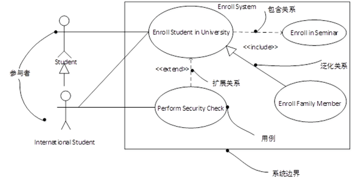

- 依赖关系:一个事物发生变化影响另一个事物。
- 泛化关系:特殊/-般关系
- 关联关系:描述了一组链，链是对象之间的连接。
- 聚合关系（公司&研发部）:整体与部分生命周期不同。
- 组合关系（人&脑   ）:整体与部分生命周期相同。
- 实现关系:接口与类之间的关系

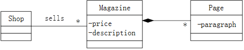

~~~
(2017年下半年试题41-43)
如下所示的UML类图中，Shop和Magazine之间为（）关系，Magazine和Page之间为（）关系。UML类图通常不用于对（）进行建模。
 
（41）A．关联
B.依赖
C.组合
D.继承
（42）A．关联
B.依赖
C.组合
D.继承
（43）A．系统的词汇
B.简单的协作
C.逻辑数据库模式
D.对象快照
试题分析
1、关联关系的表示图法。
2、实心凌形表示组合。
3、对象快照是对象图的。
试题答案
（41）A（42）C（43）D

~~~

~~~
(2016年下半年试题42-43)
下图①②③④所示是UML（）。现有场景：一名医生（Doctor）可以治疗多位病人（Patient），一位病人可以由多名医生治疗，一名医生可能多次治疗同一位病人。要记录哪名医生治疗哪位病人时，需要存储治疗（Treatment）的日期和时间。以下①②③④图中（）。是描述此场景的模型。
 
（42）A．用例图
B.对象图
C.类图
D.协作图

（43）A．①
B.②
C.③
D.④
试题分析
1是标准的类图
2.根据题中关系描述，应该是3.这时候医生跟病人关系是多对多，且治疗这个处理过程正确
试题答案
（42）C（43）C

~~~

~~~
(2016年上半年试题40)
UML中关联是一个结构关系，描述了一组链。两个类之间（）关联。
（40）A．不能有多个
B.可以有多个由不同角色标识的
C.可以有任意多个
D.的多个关联必须聚合成一个
试题分析
两个类之间可以由不同角色标识存在多个关联，如：
 
试题答案
（40）B

~~~

#### 2.3 顺序图-★★★★

#### 2.4 通信图-★★★

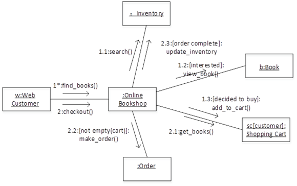

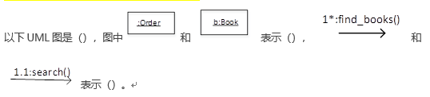

~~~
(2017年上半年试题41-43)
以下UML图是（），图中 和 表示（）， 和 表示（）。

（41）A．序列图
B.状态图
C.通信图
D.活动图

（42）A．类
B.对象
C.流名称
D.消息

（43）A．类
B.对象
C.流名称
D.消息
试题分析
从图示可以了解到，题目中的图是通信图。通信图描述的是对象和对象之间的关系，即一个类操作的实现。简而言之就是，对象和对象之间的调用关系，体现的是一种组织关系。该图明显表达的是对象与对象之间的关系。其中如果一个框中的名称中带有“:”号，说明这表示的是一个对象，“:”号前的部分是对象名，“:”号后面的部分是类名。而对象之间连线上面的箭头所标识的是对象之间通信的消息。
试题答案
（41）C（42）B（43）D

~~~

#### 2.5 状态图-★★★

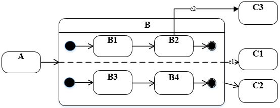

~~~
(2016年下半年试题40)
如下所示的UML状态图中，（）时，不一定会离开状态B
 
（40）A．状态B中的两个结束状态均达到
B.在当前状态为B2时，事件e2发生
C.事件e2发生
D.事件e1发生
试题分析
e2发生时只是从B2出来，还有B4等，不一定离开了B
试题答案
（40）C

~~~

~~~
(2016年下半年试题41)
以下关于UML状态图中转换（transition）的叙述中，不正确的是（）。
（41）A．活动可以在转换时执行也可以在状态内执行
B.监护条件只有在相应的事件发生时才进行检查
C.一个转换可以有事件触发器、监护条件和一个状态
D.事件触发转换
试题分析
转换应该有多个状态
试题答案
（41）C

~~~

#### 2.6 活动图-★★★

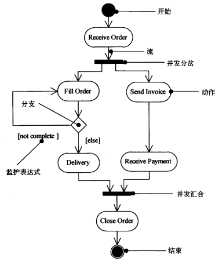

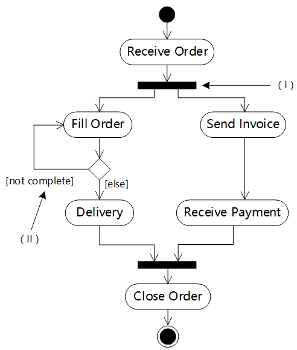

~~~
(2016年上半年试题41-43)
如下所示的UML图是（），图中（Ⅰ）表示（），（Ⅱ）表示（）。

（41）A．序列图
B.状态图
C.通信图
D.活动图

（42）A．合并分叉
B.分支
C.合并汇合
D.流

（43）A．分支条件
B.监护表达式
C.动作名
D.流名称
试题分析
本题所涉及到的图为活动图，该图容易与状态图混淆，对于初学者，可以把握一个原则来判断，即：状态图中每个结点对应的是状态，而状态与状态之间的变迁涉及到事件触发，所以在状态图中，每条箭线上都会有事件，而活动图则不一定有。
在活动图中，各个组成部分的标准名称为：
 
试题答案
（41）D（42）A（43）B

~~~

~~~
(2014年上半年试题41)
对一个复杂用例中的业务处理流程进行进一步建模的最佳工具是UML（）。
（41）A．状态图
B.顺序图
C.类图
D.活动图
试题分析
（1）类图（classdiagram）。类图描述一组类、接口、协作和它们之间的关系。在OO系统的建模中，最常见的图就是类图。类图给出了系统的静态设计视图，活动类的类图给出了系统的静态进程视图。
（2）对象图（objectdiagram）。对象图描述一组对象及它们之间的关系。对象图描述了在类图中所建立的事物实例的静态快照。和类图一样，这些图给出系统的静态设计视图或静态进程视图，但它们是从真实案例或原型案例的角度建立的。
（3）构件图（componentdiagram）。构件图描述一个封装的类和它的接口、端口，以及由内嵌的构件和连接件构成的内部结构。构件图用于表示系统的静态设计实现视图。对于由小的部件构建大的系统来说，构件图是很重要的。构件图是类图的变体。
（4）组合结构图（compositestructurediagram）。组合结构图描述结构化类（例如，构件或类）的内部结构，包括结构化类与系统其余部分的交互点。组合结构图用于画出结构化类的内部内容。
（5）用例图（usecasediagram）。用例图描述一组用例、参与者及它们之间的关系。用例图给出系统的静态用例视图。这些图在对系统的行为进行组织和建模时是非常重要的。
（6）顺序图（sequencediagram，序列图）。顺序图是一种交互图（interactiondiagram），交互图展现了一种交互，它由一组对象或参与者以及它们之间可能发送的消息构成。交互图专注于系统的动态视图。顺序图是强调消息的时间次序的交互图。
（7）通信图（communicationdiagram）。通信图也是一种交互图，它强调收发消息的对象或参与者的结构组织。顺序图和通信图表达了类似的基本概念，但它们所强调的概念不同，顺序图强调的是时序，通信图强调的是对象之间的组织结构（关系）。在UML1.X版本中，通信图称为协作图（collaborationdiagram）。
（8）定时图（timingdiagram，计时图）。定时图也是一种交互图，它强调消息跨越不同对象或参与者的实际时间，而不仅仅只是关心消息的相对顺序。
（9）状态图（statediagram）。状态图描述一个状态机，它由状态、转移、事件和活动组成。状态图给出了对象的动态视图。它对于接口、类或协作的行为建模尤为重要，而且它强调事件导致的对象行为，这非常有助于对反应式系统建模。
（10）活动图（activitydiagram）。活动图将进程或其他计算结构展示为计算内部一步步的控制流和数据流。活动图专注于系统的动态视图。它对系统的功能建模和业务流程建模特别重要，并强调对象间的控制流程。
（11）部署图（deploymentdiagram）。部署图描述对运行时的处理节点及在其中生存的构件的配置。部署图给出了架构的静态部署视图，通常一个节点包含一个或多个部署图。
（12）制品图（artifactdiagram）。制品图描述计算机中一个系统的物理结构。制品包括文件、数据库和类似的物理比特集合。制品图通常与部署图一起使用。制品也给出了它们实现的类和构件。
（13）包图（packagediagram）。包图描述由模型本身分解而成的组织单元，以及它们之间的依赖关系。
（14）交互概览图（interactionoverviewdiagram）。交互概览图是活动图和顺序图的混合物。
试题答案
（41）D

~~~

#### 2.7 组件图

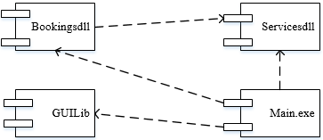

~~~
(2015年下半年试题43)
下所示为UML（）。
 
（43）A．类图
B.部署图
C.组件图
D.网络图
试题分析
本题考查统一建模语言（UML）的基本知识。
UML中提供了多种建模系统的图，体现系统的静态方面和动态方面。类图（classdiagram）展现了一组对象、接口、协作和它们之间的关系。在面向对象系统的建模中所建立的最常见的图就是类图。类图给出系统的静态设计视图。部署图（deploymentdiagram）是用来对面向对象系统的物理方面建模的方法，展现了运行时处理结点以及其中构件（制品）的配置。部署图对系统的静态部署视图进行建模，它与组件图（构件图）相关。组件图或构件图（componentdiagram）展现了一组构件之间的组织和依赖，如题中的图所示。组件图或构件图专注于系统的静态实现视图。它与类图相关，通常把构件映射为一个或多个类、接口或协作。UML部署图经常被认为是一个网络图。
试题答案
（43）C

~~~

#### 2.8 序列图

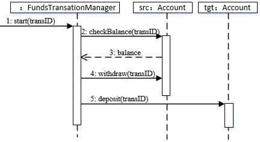

~~~
(2014年上半年试题42-43)
如下所示的序列图中（）表示返回消息，Accunt类必须实现的方法有（）。

（42）A．tansID
B.balance
C.withdraw
D.deposit

（43）A．start()
B.checkBalance()和withdraw()
C.deposit()
D.checkBalance()、withdraw()和deposit()
试题分析
UML序列图中，返回消息使用虚线带箭头表示，同步消息（调用消息）使用实线带实心箭头表示，异步消息使用实线带箭头表示。
由图示，FundsTransactionManager会调用Account的checkBalance()、withdraw()和deposit()消息。

试题答案
（42）B（43）D

~~~

### 3. 设计模式-★★★★★

#### 3.1 概述

- 创建型模式
  - 工厂方法( factory method)模式
  - 抽象工厂( abstract factory)模式
  - 原型( prototype )模式
  - 单例( singleton )模式
  - 构建器( builder )模式
- 结构型模式
  - 适配器( adapter)模式
  - 桥接( bridge)模式
  - 组合( composite )横式
  - 装饰( decorator )模式
  - 外观( facade)模式
  - 享元( flyweight )模式
  - 代理( proxy )模式

- 行为型模式
  - 职责链( chain of responsibility )模式
  - 命令( command )模式
  - 解释器( interpreter )模式
  - 迭代器( iterator )模式
  - 中介者( mediator)模式
  - 备忘录( memento )模式
  - 观察者( observer )模式
  - 状态( state )模式
  - 策略( strategy)檀式
  - 模板方法( template method)模式
  - 访问者( visitor )模式

~~~
抽象工厂模式（AbstractFactory）:提供一个接口，可以创建一系列相关或相互依赖的对象，而无需指定它们具体的类。
构建器模式（Builder）：将一个复杂类的表示与其构造相分离，使得相同的构建过程能够得出不同的表示。
工厂方法模式（FactoryMethod）：定义一个创建对象的接口，但由子类决定需要实例化哪一个类。工厂方法使得子类实例化的过程推迟。
原型模式（Prototype）：用原型实例指定创建对象的类型，并且通过拷贝这个原型来创建新的对象。
单例模式（Singleton）:保证一个类只有一个实例，并提供一个访问它的全局访问点。
适配器模式（Adapter）：将一个类的接口转换成用户希望得到的另一种接口。它使原本不相容的接口得以协同工作。
桥接模式（Bridge）：将类的抽象部分和它的实现部分分离开来，使它们可以独立地变化。
组合模式（Composite）：将对象组合成树型结构以表示“整体-部分”的层次结构，使得用户对单个对象和组合对象的使用具有一致性。
装饰模式（Decorator）：动态地给一个对象添加一些额外的职责。它提供了用子类扩展功能的一个灵活的替代，比派生一个子类更加灵活。
外观模式（Facade）:定义一个高层接口，为子系统中的一组接口提供一个一致的外观，从而简化了该子系统的使用。
享元模式（Flyweight）：提供支持大量细粒度对象共享的有效方法。
代理模式（Proxy）：为其他对象提供一种代理以控制这个对象的访问。
职责链模式（ChainofResponsibility）：通过给多个对象处理请求的机会，减少请求的发送者与接收者之间的耦合。将接收对象链接起来，在链中传递请求，直到有一个对象处理这个请求。
命令模式（Command）：将一个请求封装为一个对象，从而可用不同的请求对客户进行参数化，将请求排队或记录请求日志，支持可撤销的操作。
解释器模式（Interpreter）：给定一种语言，定义它的文法表示，并定义一个解释器，该解释器用来根据文法表示来解释语言中的句子。
迭代器模式（Iterator）：提供一种方法来顺序访问一个聚合对象中的各个元素，而不需要暴露该对象的内部表示。
中介者模式（Mediator）：用一个中介对象来封装一系列的对象交互。它使各对象不需要显式地相互调用，从而达到低耦合，还可以独立地改变对象间的交互。
备忘录模式（Memento）在不破坏封装性的前提下，捕获一个对象的内部状态，并在该对象之外保存这个状态，从而可以在以后将该对象恢复到原先保存的状态。
观察者模式（Observer）：定义对象间的一种一对多的依赖关系，当一个对象的状态发生改变时，所有依赖于它的对象都得到通知并自动更新。
状态模式（State）：允许一个对象在其内部状态改变时改变它的行为。
策略模式（Strategy）：定义一系列算法，把它们一个个封装起来，并且使它们之间可互相替换，从而让算法可以独立于使用它的用户而变化。
模板方法模式（TemplateMethod）：定义一个操作中的算法骨架，而将一些步骤延迟到子类中，使得子类可以不改变一个算法的结构即可重新定义算法的某些特定步骤。
访问者模式（Visitor）：表示一个作用于某对象结构中的各元素的操作，使得在不改变各元素的类的前提下定义作用于这些元素的新操作

~~~

#### 3.2 创建型模式

##### 3.2.1 工厂模式

​		工厂模式的意图是:定义一个创建对象的接口,但由子类决定需要实例化哪一实现，厂方法使得子类实例化的过程推迟。

- Product :产品角色定义产品的接口。
- ConcreteProduct :真实的产品，实现接口Product的类。
- Creator :工厂角色声明工厂方法( Factory Method) ,返回一个产品的实现
- ConcreteCreator :真实的工厂实现Factory Method工厂方法，由客户调用, 返回一个产品的实例。

##### 3.2.2 抽象工厂

​		抽象工厂模式的意图是:提供一个接口,可以创建一系列相关或相互依赖的对象，而无须指定它们具体的类。

- AbstractFactory :抽象工厂, 声明抽象产品的方法。
- ConcreteFactory :具体工厂, 执行生成抽象产品的方法,生成个具体的
- AbstractProduct :抽象产品，为种产品声明接口。
- Product:具体产品，定义具体工厂生成的具体产品的对象,实现产品接口
- Client :客户,我们的应用程序使用抽象产品和抽象工厂“生成对象，

~~~
(2016年上半年试题44)
为图形用户界面（GUI）组件定义不同平台的并行类层次结构，适合采用（）模式。
（44）A．享元（Flyweight）
B.抽象工厂（AbstractFactory）
C.外观（Facade））
D.装饰器（Decorator）
试题分析
抽象工厂模式的特点
试题答案
（44）B

~~~

##### 3.2.3 原型模式-Prototype

​		原型模式的意图是:用原型实例指定创建对象的类型,并且通过拷贝这个原型来创建新的对象。

- Prototype :抽象原型类定义具有克隆自己的方法的接口实现
- ConcretePrototype :具体原型类实现具体的克降方法。
- Client :客户。

##### 3.2.4 单例模式-Singleton

​		单例模式(单件模式)的意图是:保证一个类只有一 个实例,并提供访问它的全局访问点。

- Singleton :单例提供一个instance的方法 ,让客户可以使用它的唯一内部实现只生成一个实例。

##### 3.2.5 生成器模式-Builder

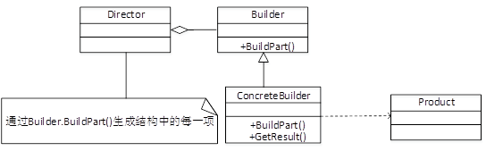

​		生成器(构建器)模式的意图是:将一个复杂类的表示与其构造相分离,使得相同的构建过程能够得出不同的表示。

- Builder :抽象建造者,为创建一个Product对象各个部件指定抽象接口,把产品的过程分解为不同的步骤,从而使具体处造者在具体的建造步骤上具有更多弹性, 造出不同表示的产品。
- ConcreteBuilder :具体建造者,实现Builder接口,构造和装配产品的各个部分，明确它所创建的表示,提供一个返回这个产品的接口。
- Director :指挥者,构建-个是使用Builder接口的对象。
- Product :产品角色,被构建的复杂对象,具体产品建造者,创建该产品的内部，定义他的装配过程。

~~~
(2014年下半年试题46-47)
图所示为（）设计模式，适用于（）。
 
（46）A．抽象工厂(AbstractFactory)
B.生成器(Builder)
C.工厂方法(FactoryMethod)．
D.原型(Prototype)

（47）A．一个系统要由多个产品系列中的一个来配置时
B.当一个类希望由它的子类来指定它所创建的对象时
C.当创建复杂对象的算法应该独立于该对象的组成部分及其装配方式时
D.当一个系统应该独立于它的产品创建、构成和表示时
试题分析
图中所示模式为生成器模式，该模式适用于当创建复杂对象的算法应该独立于该对象的组成部分及其装配方式时。
试题答案
（46）B（47）C

~~~

##### 3.2.6 适配器模式-Adapter

适配器模式的意图是:将一个类的接口转换成用户希望得到的另-种接口，它使原本不相容的接口得以协同工作。

- 目标抽象( Target )类:定义客户要用的特定领域的接口。
- 适配器公接口( Adapter) : 调用另一个接口,作为一个转换器。
- 适配器母接口( Adaptee ) : Adapter需要接入。
- 客户调用( Client )类:协同对象符合Adapter适配器(公接口).

~~~
(2014年上半年试题46-47)
下列设计模式中，（）模式既是类结构型樽式，又是对象结构型模式。此模式与（）模式类似的特征是，都给另一个对象提供了一定程度上的间接性，都涉及到从自身以外的一个接口向这个对象转发请求。
（46）A．桥接（Bridge）
B.适配器（Adapter）
C.组成(Composite)
D.装饰器(Decorator)

（47）A．桥接（Bridge）
B.适配器（Adapter）
C.组成(Composite)
D.装饰器(Decorator)
试题分析
适配器（adapter）模式。适配器模式将一个接口转换成客户希望的另一个接口，从而使接口不兼容的那些类可以一起工作。适配器模式既可以作为类结构型模式，也可以作为对象结构型模式。在类适配器模式中，通过使用一个具体类将适配者适配到目标接口中；在对象适配器模式中，一个适配器可以将多个不同的适配者适配到同一个目标。
桥接（bridge）模式。桥接模式将抽象部分与它的实现部分分离，使它们都可以独立地变化。它是一种对象结构型模式，又称为柄体（handleandbody）模式或接口（interface）模式。桥接模式类似于多重继承方案，但是多重继承方案往往违背了类的单一职责原则，其复用性比较差，桥接模式是比多重继承方案更好的解决方法。
组合（composite）模式。组合模式又称为整体-部分（part-whole）模式，属于对象的结构模式。在组合模式中，通过组合多个对象形成树形结构以表示整体-部分的结构层次。组合模式对单个对象（即叶子对象）和组合对象（即容器对象）的使用具有一致性。
装饰（decorator）模式。装饰模式是一种对象结构型模式，可动态地给一个对象增加一些额外的职责，就增加对象功能来说，装饰模式比生成子类实现更为灵活。通过装饰模式，可以在不影响其他对象的情况下，以动态、透明的方式给单个对象添加职责；当需要动态地给一个对象增加功能，这些功能可以再动态地被撤销时可使用装饰模式；当不能采用生成子类的方法进行扩充时也可使用装饰模式。
试题答案
（46）B（47）A

~~~

#### 3.3 结构性模式

##### 3.3.1 适配器模式

##### 3.3.2 享元模式

~~~
(2016年上半年试题47)
因使用大量的对象而造成很大的存储开销时，适合采用（）模式进行对象共享，以减少对象数量从而达到较少的内存占用并提升性能。
（47）A．组合（Composite）
B.享元（Flyweight）
C.迭代器（Iterator）
D.备忘（Memento）
试题分析
享元模式提供支持大量细粒度对象共享的有效方法。

~~~

##### 3.3.3 组合模式

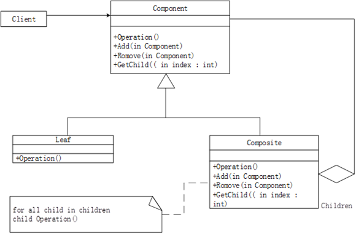

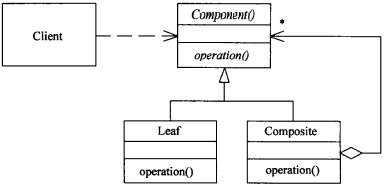

~~~
(2015年上半年试题44-46)
下图所示为（）设计模式，属于（）设计模式，适用于（）。
 
（44）A．代理（Proxy）
B.生成器《Builder)
C.组合(Camposite)
D.观察者(Observer)

（45）A．创建型
B.结构型
C.行为
D.结构型和行为

（46）A．表示对象的部分一整体层次结构时
B.当一个对象必须通知其它对象，而它又不能假定其它对象是谁时
C.当创建复杂对象的算法应该独立于该对象的组成部分及其装配方式时
D.在需要比较通用和复杂的对象指针代替简单的指针时
试题分析
本题考查设计模式的基本概念。
每一个设计模式都集中于一个特定的面向对象设计问题或设计要点，描述了什么时候使用它，在另一些设计约束条件下是否还能使用，以及使用的效果和如何取舍。按照设计模式的目的可以分为创建型、结构型和行为型三大类。创建型模式与对象的创建有关；结构型模式处理类或对象的组合；行为型模式对类或对象怎样交互和怎样分配职责进行描述。每种设计模式都有其适应性，描述适用于解决的问题场合。
创建型模式包括FactoryMethod、AbstractFactory、Builder、Portotype和Singleton。结构型模式包括Adapter(类)、Adapter(对象)、Bridge、Composite、Decorator、Facade、Flyweight和Proxy。行为型模式包括Intepreter、TemplateMethod、ChainofResponsibility、Command、Iterator、Mediator、MementoObserverStateStrategy和Vìsitor。
Proxy模式的结构图如下所示：
 
Proxy模式适用于在需要比较通用和复杂的对象指针代替简单的指针的时候，常见情况有：远程代理(RemoteProxy)为一个对象在不同地址空间提供据不代表；虚代理(VirtualProxy)根据需要创建开销很大的对象；保护代理(ProtectionProxy)控制对原始对象的访问，用于对象应该有不同的访问权限的时候；智能指引(SmartReference)取代了简单的指针，它在访问对象时执行一些附加操作。
Builder模式的结构图如下所示：
 
Builder模式适用于当创建复杂对象的算法应该独立于该对象的组成部分以及它们的装配方式时；当构造过程必须允许被构造的对象有不同的表示时。
Composite模式的结构图如下所示：
 
Composite模式适用于：想表示对象的部分-整体层次结构；希望用户忽略组合对象与单个对象的不同，用户将统一地使用组合结构中的所有对象。
Observer模式的结构图如下所示：
 
Observer模式适用于：当一个抽象模型有两个方面，其中一个方面依赖于另一个方面。将这两者封装在独立地对象中以使它们可以各自独立地改变和复用；当对一个对象的改变需要同时改变其他对象，而不知道具体有多少对象有待改变时；当一个对象必须通知其他对象，而它又不能假定其他对象是谁，即不希望这些对象是紧耦合的。

~~~

##### 3.3.4 代理模式

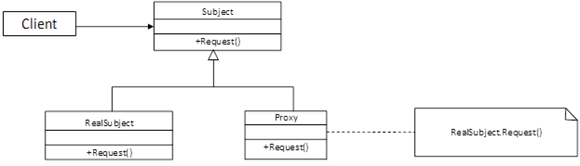

##### 3.3.5 外观模式

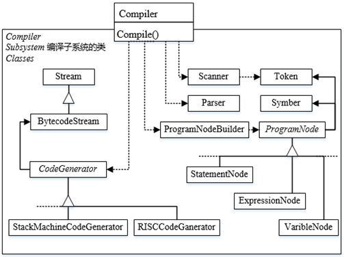

~~~
(2014年上半年试题44-45)
下图所示为（）设计模式，适用于（）。
 
（44）A．适配器（Adapter）
B.责任链（ChainofResponsibility）
C.外观（Facade）
D.桥接（Bridge）

（45）A．有多个对象可以处理一个请求，在运行时刻自动确定由哪个对象处理
B.想使用一个已经存在的类，而其接口不符合要求
C.类的抽象和其实现之间不希望有一个固定的绑定关系
D.需要为一个复杂子系统提供一个简单接口
试题分析
外观模式是一种使用频率非常高的结构型设计模式，它通过引入一个外观角色来简化客户端与子系统之间的交互，为复杂的子系统调用提供一个统一的入口，降低子系统与客户端的耦合度，且客户端调用非常方便。
试题答案
（44）C（45）D

~~~

#### 3.4 行为性模式

##### 3.4.1 状态模式

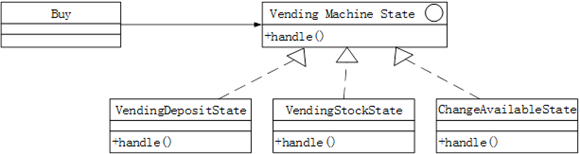

~~~
(2017年下半年试题44-47)
自动售货机根据库存、存放货币量、找零能力、所选项目等不同，在货币存入并进行选择时具有如下行为：交付产品不找零；交付产品并找零；存入货币不足而不提供任何产品；库存不足而不提供任何产品。这一业务需求适合采用（）模式设计实现，其类图如下图所示，其中（）是客户程序使用的主要接口，可用状态来对其进行配置。此模式为（），体现的最主要的意图是（）。
 
（44）A．观察者（Observer）
B.状态（State）
C.策略（Strategy）
D.访问者（Visitor）

（45）A．VendingMachineState
B.Buy
C.VendingDepositState
D.VendingStockState

（46）A．创建型对象模式
B.结构型对象模式
C.行为型类模式
D.行为型对象模式

（47）A．当一个对象状态改变时所有依赖它的对象得到通知并自动更新
B.在不破坏封装性的前提下，捕获对象的内部状态并在对象之外保存
C.一个对象在其内部状态改变时改变其行为
D.将请求封装为对象从而可以使用不同的请求对客户进行参数化
试题分析
1、有State关键词，状态模式：允许一个对象在其内部状态改变时改变它的行为。对象看起来似乎修改了它的类。在很多情况下，一个对象的行为取决于一个或多个动态变化的属性，这样的属性叫做状态，这样的对象叫做有状态的(stateful)对象，这样的对象状态是从事先定义好的一系列值中取出的。当一个这样的对象与外部事件产生互动时，其内部状态就会改变，从而使得系统的行为也随之发生变化。
2、是整个状态模式的基类也是对外的接口。
试题答案
（44）B（45）A（46）D（47）C

~~~

##### 3.4.2 观察者模式

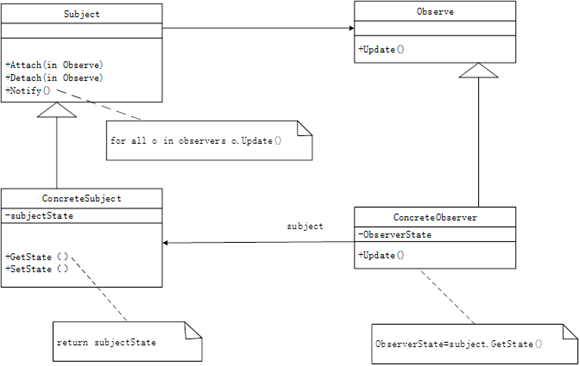

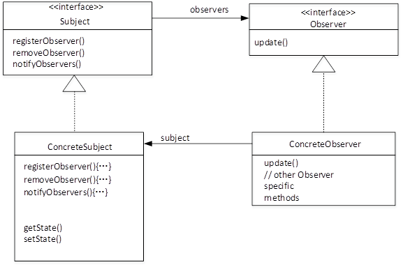

~~~
(2017年上半年试题44-45)
下图所示为观察者(Obserrver)模式的抽象示意图，其中（）知道其观察者，可以有任何多个观察者观察同一个目标;提供住处和删除观察者对象的接口。此模式体现的最主要的特征是（）。
 
（44）A．Subject
B.Observer
C.ConcreteSubject
D.ConcreteObserver

（45）A．类应该对扩展开放，对修改关闭
B.使所要交互的对象尽量松耦合
C.组合优先于继承使用
D.仅与直接关联类交互
试题分析
观察者将自己注册到事件，那么具体的事件就知道了自己的观察者。观察者和事件都有自己的抽象，当实现具体的观察者和事件的时候都要实现相应接口，所以对扩展是开放的。
试题答案
（44）C（45）A

~~~

##### 3.4.3 策略模式

~~~
(2016年下半年试题44-45)
（）模式定义一系列的算法，把它们一个个封装起来，并且使它们可以相互替换，使得算法可以独立于使用它们的客户而变化。以下（）情况适合选用该模式。
①一个客户需要使用一组相关对象
②一个对象的改变需要改变其它对象
③需要使用一个算法的不同变体
④许多相关的类仅仅是行为有异

（44）A．命令（Command）
B.责任链（ChainofResponsibility）
C.观察者（Observer）
D.策略（Strategy）

（45）A．①②
B.②③
C.③④
D.①④
试题分析
策略模式定义了一系列的算法，并将每一个算法封装起来，而且使它们还可以相互替换。策略模式让算法独立于使用它的客户而独立变化。
应用场景：
1、多个类只区别在表现行为不同，可以使用Strategy模式，在运行时动态选择具体要执行的行为。
2、需要在不同情况下使用不同的策略(算法)，或者策略还可能在未来用其它方式来实现。
3、对客户隐藏具体策略(算法)的实现细节，彼此完全独立。
试题答案
（44）D（45）C

~~~

##### 3.4.4 命令模式

~~~
(2016年上半年试题45)
（）设计模式将一个请求封装为一个对象，从而使得可以用不同的请求对客户进行参数化，对请求排队或记录请求日志，以及支持可撤销的操作。
（45）A．命令（Command）
B.责任链（ChainofResponsibility）
C.观察者（Observer）
D.策略（Strategy）
试题分析
命令模式的特点为：将一个请求封装为一个对象，从而可用不同的请求对客户进行参数化，将请求排队或记录请求日志，支持可撤销的操作
试题答案
（45）A

~~~

##### 3.4.5 访问模式

~~~
(2015年上半年试题47)
某些设计模式会引入总是被用作参数的对象（）对象是一个多态accept方法的参数。
（47）A．Visitor
B.Command
C.Memento
D.Observer
试题分析
本题考查设计模式的概念，对行为模式进行比较。
很多行为模式注重封装变化。当一个程序的某个方面的特征经常发生改变时，这些模式就定义一个封装这个方面的对象。这样，当该程序的其他部分依赖于这个方面时，它们都可以与此对象协作。一些模式引入总是被用作参数的对象。有些模式定义一些可作为令牌进行传递的对象，这些对象将在稍后被调用。
在Visitor模式中，一个Visitor对象是一个多态的accept操作的参数，这个操作作用于该Visitor对象访问的对象。在Command模式中，令牌代表一个请求；在Memento模式中，它代表在一个对象在某个特定时刻的内部状态。在这两种情况下，令牌都可以有一个复杂的内部表示，但客户并不会意识到这一点。在Observer模式中，通过引入Observer和Subject对象来分布通信。
试题答案
（47）A

~~~

##### 3.4.6 中介模式

~~~
(2014年下半年试题43-44)
一组对象以定义良好但是复杂的方式进行通信，产生的相互依赖关系结构混乱且难以理解。采用（）模式，用一个中介对象来封装一系列的对象交互，从而使各对象不需要显式地相互引用，使其耦合松散。而且可以独立地改变它们之间的交互。此模式与（）模式是相互竞争的模式，主要差别是：前者的中介对象封装了其它对象间的通信，而后者通过引入其它对象来分布通信。
（43）A．解释器(Interpreter)
B.策略(Strategy)
C.中介者(Mediator)
D.观察者(Observer)

（44）A．解释器(Interpreter)
B.策略(Strategy)
C.中介者(Mediator)
D.观察者(Observer)
试题分析
中介者就是一个处于众多对象，并恰当地处理众多对象之间相互之间的联系的角色。中介者模式与观察者模式是相互竞争的模式。
试题答案
（43）C（44）D

~~~

