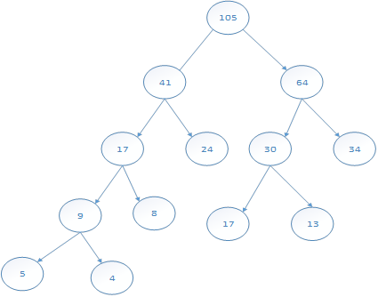

## 数据结构与算法基础

### 1. 数组与矩阵-★★

​				 

#### 1.1 稀疏矩阵

### 2. 线性表-★★★★★ 

#### 顺序存储与链式存储对比

#### 队列与栈

元素按照a、b、c的次序进入栈,请尝试写出其所有可能出栈可能

cba、bca、bac、abc、acb

### 3. 广义表-★★

1.广义表是n个表元素组成的有限序列 ,是线性表的推广。
2.通常用递归的形式进行定义 ,记做: LSD (aO, a.. an).
3.注其中LS是表名, a是表元素，它可以是表(称做子表, 也可以是数据元素(称为原子
n是广义表的长度(也就是最外层包含的元素个数) , nD 0的广义表为空表;而递归定义的
广义表的深度，直观地说，就是定义中所含活号的重数(原子的深度为0 ,空表的深度为1
4.基本运算:取表头head(Ls)和取表尾tail(Ls).
5.若有:LS1=(a, (b,c) , (d,e) )

6.head(LS1)=a

7.tail(LS1)=((b,c) ，(d,e))
8.例1, 有广义表LS1=(a, (b,c) , (d,e) ) , 则其长度为?深度为?
9.例2，有广义表LS1=(a, (b,c) , (d,e) ) ,要将其中的b字母取出,操作就为?
例题1答案:长度为3 ,深度为2.
例题2箸案: head(head(til(L1))).

### 4. 树与二叉树-★★★★★

#### 4.1 树

4层树 

#### 4.2 二叉树

二叉树的要特性:
非完全二叉树
非完全二叉树
1、在二义树的第i层上最多有2-1个结点(i>=1) ;
2、深度为k的二叉树最多有2 -1个结点(k>=1) ;
3、对任何一棵二叉树，如果其叶子结点数为n，度为2的结点数为n2 ,则no=n2+1.
4、如果对棵有n个结点的完全:二叉树的结点按层序编号(从第1层到[log2n]+1层，每层从左到右)则对任一结点( 1<=i<=n) ,有

- 如果i=1 ,则结点无父结点，是二叉树的根;如果i>1 ,则父结点是i/2」
- 如果2i>n,则结点为叶子结点，无左子结点;否则，其左子结点是结点2i ; 
- 如果2i+1>n,则结点无右子叶点，否则其左子结点具结点+1

#### 4.3 二叉树遍历

- 前12457836（根左右）
- 中42785136（左根右）
- 后45752681（左右根）
- 层12345678

#### 4.4 反向求二叉树

#### 4.5 树转二叉树

#### 4.6 查找二叉树

插入节点

①若该键值结点已存在,则不再插入，如: 48;
②若查找二叉树为空树,则以新结点为查找二叉树;
③将要插入结点键值与插入后父结点键值比较,就能
确定新结点是父结点的左子结点,还是右子结点。
删除结点:
➊若待删除结点是叶子结点,则直接删除;
②若待删除结点只有一个子结点,则将这个子结点与
待删除结点的父结点直接连接，如: 56;
③若待删除的结点p有两个子结点,则在其左子树上
用中序遍历寻找关键值最大的结点s ,用结点s的值
代替结点p的值,然后删除节点s ,节点s必属于上
①，②情况之一,如89.

#### 4.7 最优二叉树（哈夫曼树）

​											 

~~~
(2017年下半年试题58)
假设某消息中只包含7个字符{a，b，c，d，e，f，g}，这7个字符在消息中出现的次数为{5，24，8，17，34，4，13}，利用哈夫曼树（最优二叉树）为该消息中的字符构造符合前缀编码要求的不等长编码。各字符的编码长度分别为（  ）。
（58）A．a:4,b:2,c:3,d:3,e:2,f:4,g:3
B.a:6,b:2,c:5,d:3,e:1,f:6,g:4
C.a:3,b:3,c:3,d:3,e:3,f:2,g:3
D.a:2,b:6,c:3,d:5,e:6,f:1,g:4
试题分析
哈夫曼树
  
试题答案
（58）A

~~~

~~~
(2016年下半年试题62-63)
下表为某文件中字符的出现频率，采用霍夫曼编码对下列字符编码，则字符序列“bee”的编码为（）；编码“110001001101”的对应的字符序列为（）。
 （62）A．10111011101
B.10111001100
C.001100100
D.110011011

（63）A．bad
B.bee
C.face
D.bace
试题分析
110001001101中：f(1100)a(0)c(100)e(1101)。
试题答案
（62）A（63）C

~~~

#### 4.8 线索二叉树

#### 4.9 平衡二叉树

### 5. 图-★★

#### 完全图

#### 邻接矩阵

 

#### 领接表

#### 图的遍历

#### 图的拓扑排序

#### 图的最小生成树

### 6. 排序与查找-★★★★★ 

~~~
(2015年下半年试题64-65)
在某应用中，需要先排序一组大规模的记录，其关键字为整数。若这组记录的关键字基本上有序，则适宜采用（）排序算法。若这组记录的关键字的取值均在0到9之间（含），则适宜采用（）排序算法。
（64）A．插入
B.归并
C.快速
D.计数

（65）A．插入
B.归并
C.快速
D.计数
试题分析
插入排序中的希尔排序的基本思想是：先将整个待排序的记录序列分割成为若干子序列分别进行直接插入排序，待整个序列中的记录“基本有序”时，再对全体记录进行依次直接插入排序。所以当数列基本有序时，采用插入排序算法是比较合适的。
计数排序是一个非基于比较的排序算法，该算法于1954年由HaroldH.Seward提出。它的优势在于在对一定范围内的整数排序时，它的复杂度为Ο(n+k)（其中k是整数的范围），快于任何比较排序算法。
试题答案
（64）A（65）D

~~~

### 7. 时间复杂度与空间复杂度-★★★★★

### 8. 算法基础及常见的算法-★★★★★ 

~~~
(2017年下半年试题57)
设S 是一个长度为n的非空字符串，其中的字符各不相同，则其互异的非平凡子串（非空且不同于S本身）个数为（  ）。
（57）A．2n-1
B.n²
C.n(n+1)/2
D.(n+2) (n-1)/2
试题分析
比如S字串为"abcdefg",长度为7.则S中的包含的互不相同的字串有如下一些：
1.长度为6的个数为2："abcdef"和"bcdefg"
2.长度为5的个数为3："abcde","bcdef","cdefg"
.
6.长度为1的个数为7："a","b","c","d","e","f","g"
个数总和就是2+3+4+5+6+7 = (1+2+3+..+7) - 1 = 7x(7+1)/2 - 1.
其中：
1+2+3+...+n = (1+n) + (2+(n-1)) + (3+(n-2)) + ...（首尾两项相加的和都是n+1,共 n/2个）
= n(n+1)/2
试题答案
（57）C

~~~

~~~
(2016年上半年试题62-65)
考虑一个背包问题，共有n=5个物品，背包容量为W=10，物品的重量和价值分别为：w={2，2，6，5，4}，v={6,3，5，4，6}，求背包问题的最大装包价值。若此为0-1背包问题，分析该问题具有最优子结构，定义递归式为
 
其中c（i，j）表示i个物品、容量为j的0-1背包问题的最大装包价值，最终要求解c（n,W）。
采用自底向上的动态规划方法求解，得到最大装包价值为（），算法的时间复杂度为（）。
若此为部分背包问题，首先采用归并排序算法，根据物品的单位重量价值从大到小排序，然后依次将物品放入背包直至所有物品放入背包中或者背包再无容量，则得到的最大装包价值为（），算法的时间复杂度为（）。
（62）A．11
B.14
C.15
D.16.67

（63）A．Θ(nW)
B.Θ(nlgn)
C.Θ(n2)
D.Θ(nlgnW)

（64）A．11
B.14
C.15
D.16.67

（65）A．Θ(nW)
B.Θ(nlgn)
C.Θ(n2)
D.Θ(nlgnW)
试题分析
这是典型的01背包问题，动态规划算法中，自底向上（递推）：从小范围递推计算到大范围，可以看到装第一个和第五个物品价值是最高的，这时候V=12了，然后占了6的重量了，只能装物品2了，价值15，第二个问题是部分背包，部分背包的时候计算每个物品单位重量价值多少，单位重量v={31.55/60.81.5},可以看到125的单位价值最高，选择125后背包重量还只有8，还有2个重量可以选择3得等5/3的价值，就是1.67，所以第三问为16.67
再来看复杂度，都没有进行指数级别的运算，问题1只需要找n个物品与价值W相乘，问题3计算单位物品价值然后考虑背包大小就可以了

试题答案
（62）C（63）A（64）D（65）B

~~~

