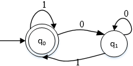
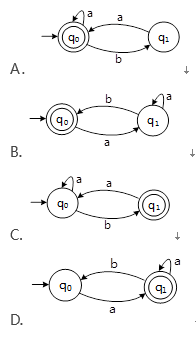

# 程序设计语言与语言处理程序基础

### 1. 编译与解释(★★★)

#### 1.1 编译

词法分析、语法分析（编译）

语义分析：静态分析（运行时）

~~~
(2017年下半年试题22)
将高级语言源程序通过编译或解释方式进行翻译时，可以先生成与源程序等价的某种中间代码。以下关于中间代码的叙述中，正确的是（）。
（22）A．中间代码常采用符号表来表示
B.后缀式和三地址码是常用的中间代码
C.对中间代码进行优化要依据运行程序的机器特性
D.中间代码不能跨平台
试题分析
B只是类似于三地址码，CD与具体的机器无关。
试题答案
（22）A

~~~

~~~
(2017年下半年试题48)
编译过程中进行的语法分析主要是分析（）。
（48）A．源程序中的标识符是否合法
B.程序语句的含义是否合法
C.程序语句的结构是否合法
D.表达式的类型是否合法
试题分析
语法分析主要是分析数据类型是否合法。
试题答案
（48）D

~~~

~~~
(2016年上半年试题20)
以下关于高级程序设计语言实现的编译和解释方式的叙述中，正确的是（）。
（20）A．编译程序不参与用户程序的运行控制，而解释程序则参与
B.编译程序可以用高级语言编写，而解释程序只能用汇编语言编写
C.编译方式处理源程序时不进行优化，而解释方式则进行优化
D.编译方式不生成源程序的目标程序，而解释方式则生成
试题分析
编译程序的功能是把用高级语言书写的源程序翻译成与之等价的目标程序。编译过程划分成词法分析、语法分析、语义分析、中间代码生成、代码优化和目标代码生成6个阶段。目标程序可以独立于源程序运行。
解释程序是一种语言处理程序，在词法、语法和语义分析方面与编译程序的工作原理基本相同，但在运行用户程序时，它是直接执行源程序或源程序的内部形式(中间代码)。因此，解释程序并不产生目标程序，这是它和编译程序的主要区别。
试题答案
（20）A

~~~

~~~
(2016年上半年试题22)
将高级语言源程序先转化为一种中间代码是现代编译器的常见处理方式。常用的中间代码有后缀式、（）、树等。
（22）A．前缀码
B.三地址码
C.符号表
D.补码和移码
试题分析
中间代码的表达形式有语法树，后缀式，三地址代码。
试题答案
（22）B

~~~

~~~
(2016年上半年试题48)
移进--归约分析法是编译程序（或解释程序）对高级语言源程序进行语法分析的一种方法，属于（）的语法分析方法。
（48）A．自顶向下（或自上而下）
B.自底向上（或自下而上）
C.自左向右
D.自右向左
试题分析
归约分析是自底向下方法中的典型。
试题答案
（48）B

~~~

~~~
(2015年上半年试题22)
C程序中全局变量的存储空间在（）分配。
（22）A．代码区
B.静态数据区
C.栈区
D.堆区
试题分析
全局变量、静态局部变量、静态全局变量都存放在静态数据存储区。
试题答案
（22）B

~~~

~~~~
(2014年下半年试题22)
将高级语言源程序翻译成机器语言程序的过程中，常引入中间代码。以下关于中间代码的叙述中，不正确的是（）。
（22）A．中间代码不依赖于具体的机器．
B.使用中间代码可提高编译程序的可移植性
C.中间代码可以用树或图表示
D.中间代码可以用栈和队列表示
试题分析
本题考查程序语言基础知识。
从原理上讲，对源程序进行语义分析之后就可以直接生成目标代码，但由于源程序与目标代码的逻辑结构往往差别很大，特别是考虑到具体机器指令系统的特点，要使翻译一次到位很困难，而且用语法制导方式机械生成的目标代码往往是繁琐和低效的，因此有必要设计一种中间代码，将源程序首先翻译成中间代码表示形式，以利于进行与机器无关的优化处理。由于中间代码实际上也起着编译器前端和后端分水岭的作用，所以使用中间代码也有助于提高编译程序的可移植性。常用的中间代码有后缀式、三元式、四元式和树(图)等形式。
试题答案
（22）D

~~~~

~~~
(2014年下半年试题48)
对高级语言源程序进行编译的过程可以分为多个阶段，分配寄存器的工作在（）阶段进行。
（48）A．词法分析
B.语法分析
C.语义分析
D.目标代码生成
试题分析
目标代码生成阶段应考虑直接影响到目标代码速度的三个问题：一是如何生成较短的目标代码；二是如何充分利用计算机中的寄存器，减少目标代码访问存储单元的次数；三是如何充分利用计算机指令系统的特点，以提高目标代码的质量。
试题答案
（48）D

~~~

### 2. 文法(★★)

#### 2.1 文法定义

#### 2.2 文法类型

~~~
(2016年下半年试题49)
乔姆斯基（Chomsky）将文法分为4种类型，程序设计语言的大多数语法现象可用其中的（）描述。
（49）A．上下文有关文法
B.上下文无关文法
C.正规文法
D.短语结构文法
试题分析
上下文无关文法：形式语言理论中一种重要的变换文法，用来描述上下文无关语言，在乔姆斯基分层中称为2型文法。由于程序设计语言的语法基本上都是上下文无关文法，因此应用十分广泛。
试题答案
（49）B

~~~

### 3. 正规式(★★★★)

### 3.1 有限自动机(★)

~~~
(2015年下半年试题49)
某非确定的有限自动机（NFA）的状态转换图如下图所示（q0既是初态也是终态）。以下关于该NFA的叙述中，正确的是（）。

 
（49）A．其可识别的0、1序列的长度为偶数
B.其可识别的0、1序列中0与1的个数相同
C.其可识别的非空0、1序列中开头和结尾字符都是0
D.其可识别的非空0、1序列中结尾字符是1
试题分析
要证明一种说法有误只需要举一反例即可，所以做这类题时，举反例排除错误选择是一个不错的选择。
由于题目所述的NFA可以解析串“1”，所以可排除：A，B，C三个选项。
试题答案
（49）D

~~~

~~~
(2015年上半年试题49)
某非确定的有限自动机(NFA)的状态转换图如下图所示（q0既是初态也是终态），与该NFA等价的确定的有限自动机(DFA)是（）。
 
（49）A． 
B. 
C. 
D. 
试题分析
本题使用代入法进行验证比较容易。
（1）代入aaa，选项B与C无法解析，故排除。
（2）代入ba，选项D无法解析，也要排除，此时可以确定正确答案为A。
试题答案
（49）A

~~~

#### 3.1.1 数据类型与程序控制结构

### 4. 后缀表达式(★★★)

后缀式：后序排序

### 5. 传值与传址(★★★★)

~~~
(2017年下半年试题50)
函数main()、f()的定义如下所示。调用函数f()时，第一个参数采用传值（callbyvalue）方式，第二个参数采用传引用（callbyreference）方式，则函数main()执行后输出的值为（）。
 
（50）A．10
B.19
C.20
D.29
试题分析
x=2*10-1=19；a=a+x=10+19=29；a是引用传递，所以结果为29。
试题答案
（50）D

~~~

~~~
(2017年上半年试题22)
在以阶段划分的编译过程中，判断程序语句的形式是否正确属于（）阶段的工作。

（22）A．词法分析
B.语法分析
C.语义分析
D.代码生成
试题分析
检查单个词是否正确，属于词法阶段的工作。而识别判断程序语句形式是否正确属于语法分析的工作。
试题答案
（22）B

~~~

### 6. 多种程序语 特点(★★★)

2018-上

 

~~~
(2017年下半年试题21)
以下关于程序设计语言的叙述中，不正确的是（）。
（21）A．脚本语言中不使用变量和函数
B.标记语言常用于描述格式化和链接
C.脚本语言采用解释方式实现
D.编译型语言的执行效率更高
试题分析
脚本语言中使用变量和函数来完成程序。
试题答案
（21）A

~~~

~~~
(2015年下半年试题22)
表达式采用逆波兰式表示时，利用（）进行求值。
（22）A．栈
B.队列
C.符号表
D.散列表
试题分析
逆波兰使用栈的基本操作流程为：从左至右将数字入栈，当遇运算符时，出栈运算符所需数据进行操作，再将操作结果入栈，依此类推。
试题答案
（22）A

~~~

~~~
(2014年上半年试题20)
以下程序设计语言中，（）更适合用来进行动态网页处理。
（20）A．HTML
B.LISP
C.PHP
D.JAVA/C++
试题分析
HTML：静态网页
LISP：一种基于λ演算的函数式编程语言
PHP：混合了C、Java、Perl以及PHP自创的语法。它可以比CGI或者Perl更快速地执行动态网页。
试题答案
（20）C

~~~

